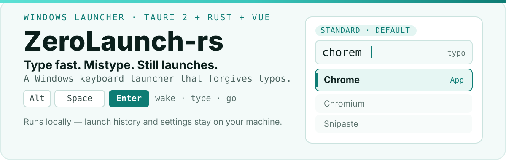
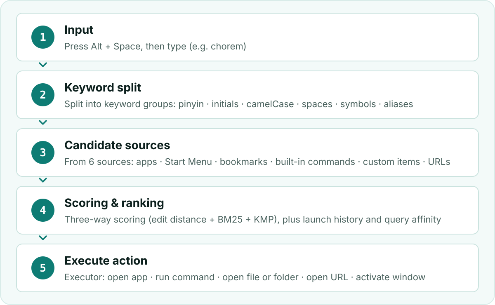

  <a href="./README.md">简体中文</a> · <a href="./README.zh-TW.md">繁體中文</a> · <strong>English</strong>

<h1 align="center">
  <picture>
    <source media="(prefers-color-scheme: dark)" srcset="./assets/readme/hero-en-dark.svg">
    
  </picture>
</h1>

  
  
  
  

  <strong>ZeroLaunch-rs is a keyboard launcher built for Windows.</strong> 
  For people who live on the keyboard: press <kbd>Alt</kbd>+<kbd>Space</kbd> to bring it up, type a few letters, <kbd>Enter</kbd> to launch; 
  typo while moving fast? No problem — the thing you're after is probably still at number one.

  <a href="https://github.com/ghost-him/ZeroLaunch-rs/releases/latest"><strong>Download the latest version</strong></a>

  <a href="#proof">Typos still hit</a> ·
  <a href="#quickstart">Up in 60 seconds</a> ·
  <a href="#capabilities">Core capabilities</a> ·
  <a href="#how">How it works</a> ·
  <a href="#extend">Extend</a> ·
  <a href="#contribute">Contribute</a>

  <picture>
    <source media="(prefers-color-scheme: dark)" srcset="./assets/readme/section-proof-dark.svg">
    
  </picture>

## Typos still hit

If you type fast, you've probably hit this failure: you mean to search `chrome`, your fingers slip and type `chorem`, and the list comes up empty — not a single one of the apps you have installed shows up.

ZeroLaunch-rs's default matching algorithm is built for exactly this. It scores every result three ways: how many letters differ from what you typed, whether the letter combinations look alike, and whether the first and middle letters line up. Off by one or two letters, or two letters swapped, and the score only drops a little instead of falling to zero.

`chorem` and `chrome` differ by a single adjacent letter swap, so in that case the top result is still Chrome. Here's what it looks like in practice (recording: first searching `ch` and `stea` normally, then scrambling `chrome` into `chormfe` and `vhcomre`):

  

> No accuracy percentages — misspell one letter, press <kbd>Enter</kbd> once and see for yourself.

  <picture>
    <source media="(prefers-color-scheme: dark)" srcset="./assets/readme/section-start-dark.svg">
    
  </picture>

## Up in 60 seconds

1. **Install**: grab the `.msi` whose filename contains `x64` from [Releases](https://github.com/ghost-him/ZeroLaunch-rs/releases) and double-click through it (only ARM laptops need the `arm64` one).
2. **Or use the portable build**: download the `ZeroLaunch-portable-…` `.zip` whose filename contains `x64`, unzip it, and run the `exe` inside.

Using it is three steps: press <kbd>Alt</kbd>+<kbd>Space</kbd> to bring it up → type a few letters → <kbd>Enter</kbd> to open. The first result is selected by default, so those three steps are all you need.

Your data lives in `C:\Users\<your-user-name>\.ZeroLaunch-rs\` (the portable build keeps everything next to the `exe`); nothing about your usage is uploaded, see [PRIVACY.md](./PRIVACY.md) for details; if you don't want it, delete that folder and uninstall.

<strong>Full manual: every key</strong>

### Bring up and dismiss

| Key | What it does |
|---|---|
| <kbd>Alt</kbd>+<kbd>Space</kbd> | Brings up the search window. This is the default; you can rebind it in settings, or switch it to "double-tap <kbd>Ctrl</kbd>". |
| <kbd>Esc</kbd> | If the input box has content, clears it; when empty, dismisses the window. With "ESC hides first" enabled in settings, it always dismisses. |
| In a panel <kbd>Esc</kbd> | First leaves the panel back to normal search; press again to dismiss. |

### Search list

| Key | What it does |
|---|---|
| <kbd>↓</kbd> / <kbd>↑</kbd> | Move the selection up and down. |
| <kbd>Ctrl</kbd>+<kbd>J</kbd> <kbd>Ctrl</kbd>+<kbd>K</kbd> | Also move up and down — the default "select next / select previous" keys, editable in settings; clear both and only the arrow keys remain. |
| <kbd>Enter</kbd> | Runs the selected entry. |
| <kbd>Ctrl</kbd>+<kbd>1</kbd>…<kbd>9</kbd> | Runs the Nth action of the selected entry (number row). |
| An entry's own shortcut | Some entries declare their own shortcut, printed right on the action button — for path and program entries, "Run as administrator" is <kbd>Ctrl</kbd>+<kbd>Enter</kbd>, and "Wake window" is <kbd>Shift</kbd>+<kbd>Enter</kbd>; press it to fire that action. |
| <kbd>Tab</kbd> <kbd>Shift</kbd>+<kbd>Tab</kbd> | Cycle forward / backward through the selected entry's actions. |
| <kbd>Home</kbd> / <kbd>End</kbd> | Jump to the first / last entry. |
| Space | Normally types a space; with "Space confirms" enabled in settings it acts like <kbd>Enter</kbd>. |
| Mouse | Click an entry to run it directly; click an action button on an entry to run just that action. |

### Entries that need arguments (a custom command, say)

| Key | What it does |
|---|---|
| <kbd>Enter</kbd> | Confirms the arguments and runs. |
| <kbd>Tab</kbd> <kbd>Shift</kbd>+<kbd>Tab</kbd> | With more than one argument, move to the next / previous field. |
| <kbd>Ctrl</kbd>+<kbd>J</kbd> <kbd>Ctrl</kbd>+<kbd>K</kbd> | Move the selection up and down (here the arrow keys are left to the input box cursor). |
| <kbd>Backspace</kbd> | While the arguments are still empty, leaves argument entry. |
| <kbd>Esc</kbd> | Leaves argument entry. |

### In plugin panels

Panel keys are declared by the plugin itself; here are the built-in ones:

| Panel | Keys |
|---|---|
| Translation | <kbd>Enter</kbd> copies the translation (triggers the translation or a retry when it isn't ready); <kbd>Ctrl</kbd>+<kbd>Enter</kbd> copies the existing translation directly; <kbd>Esc</kbd> leaves the panel. |
| Calculator | <kbd>Enter</kbd> copies the result (recomputes when there is none); <kbd>Esc</kbd> leaves. |
| Path URL | <kbd>Enter</kbd> opens; other actions (like "Open containing folder") are clicked with the mouse; <kbd>Esc</kbd> leaves back to search. |

Panel plugins use a "full takeover" model: which keys a panel needs is declared entirely by the plugin, the host only interprets the ones it declared and passes the rest through to it. So when a key does nothing in some panel, that usually means the plugin didn't declare it — that's a problem in the plugin itself, please report it to that plugin's author.

### Plugin hotkeys

A panel plugin can carry its own hotkey (for example <kbd>Ctrl</kbd>+<kbd>E</kbd>): pressed while the search window is already open, it takes you straight into that plugin's panel. It is not registered as a system-wide global hotkey, so you can't press it when the window is closed. When a hotkey collides with another plugin's, only the one with higher priority wins.

  <picture>
    <source media="(prefers-color-scheme: dark)" srcset="./assets/readme/section-capabilities-dark.svg">
    
  </picture>

## Core capabilities

After you bring it up, it's just an input box. What you type can be "the thing itself" — an app name, a folder path, a URL, an expression; or "trigger word + content", like `fy 你好`. The former goes to search, the latter to plugins (what the two kinds of plugin are and what the built-ins include is in the collapsed "Plugins" section below).

- **Found means launchable**: apps installed on the system (including from the Microsoft Store), programs in the Start menu, entries you added yourself — all in the same input box; opening uses the system default program, same as a double-click.
- **Typos still find it**: get one or two letters wrong, or swap two letters, and the list won't be empty — the thing you're after is probably still at the front.
- **Better the more you use it**: frequently used and recently used entries drift toward the front; those records live in their own file, survive restarts, and never mix into your config file.
- **Customize to your habits**: aliases, custom commands and URLs, shortcuts, UI language — all done in settings.
- **Everything has a UI**: from the summon shortcut, theme colors, and fonts to each plugin's own parameters (which model translation uses, which language it defaults to), every item has a matching control: hotkeys record on press, colors have a picker, paths and fonts have selection lists, numbers have steppers. No config file to open, and if you break something you can restore defaults in one click.

<strong>Plugins: the two forms and the built-in list</strong>

Plugins come in two kinds by how they're woken. **Inline plugins** take over while you type, with results embedded in the search window; **panel plugins** don't take over input, but become a candidate of their own and, once selected, take over the whole page.

Inline plugins play two ways. One is **replacing a built-in part**: a plugin can declare that it implements the search engine, candidate source, action execution, scoring rules, or keyword processing slot, standing on equal footing with the built-in components and bumping the built-in one out once installed. The other is **bringing its own interaction**: translation and calculator are like this — you type `fy 你好` or `= 12*8` and the results area switches to its panel, while the search bar stays. Path and URL don't even need a trigger word; they're recognized by shape: how you tell it "this is the one" is to type a trailing space (e.g. `github.com `), and when the path itself contains spaces, wrap the whole thing in quotes (e.g. `"C:\Program Files"`).

A panel plugin's trigger word becomes a candidate keyword. Type that word and the plugin shows up in the list; after Enter it fills the whole window, leaving no search bar; such plugins can also register a global hotkey to open in one press.

The built-in plugins work without installing anything extra, and you can turn off any you don't want individually in settings:

- **App search**: `chrome` launches an app (`微信` searches in Chinese directly, `qqy` searches QQ Music directly).
- **Path and URL**: `D:\Downloads ` opens a folder, `github.com ` opens a URL (a trailing space means "this is it"; paths with spaces go in quotes).
- **Calculator**: `= 12*8` gives the result directly.
- **Translation**: starts with `fy`, `tr`, or `翻译` (a literal Simplified-Chinese keyword), can translate as you type or only on Enter; the first time you use it you need to set up a chat model in settings (a local Ollama or an OpenAI-compatible endpoint both work) — without one, no results.
- **Bookmark search**: automatically reads bookmarks from Chrome, Edge, and other browsers; type a bookmark title to open it.
- **Built-in commands**: type `settings` / `refresh` / `reshortcut` / `gamemode` / `exit` (the Chinese keywords `设置` / `刷新` / `注册` / `游戏` / `退出` work too) to open settings, rebuild the index, re-register the shortcuts, toggle game mode, and quit the app respectively.
- **Custom commands and URLs**: save the things you use often as your own entries; next time, type the keyword to run or open them.

  <picture>
    <source media="(prefers-color-scheme: dark)" srcset="./assets/readme/section-how-dark.svg">
    
  </picture>

## How it works

  <picture>
    <source media="(prefers-color-scheme: dark)" srcset="./assets/readme/pipeline-en-dark.svg">
    
  </picture>

From pressing <kbd>Alt</kbd>+<kbd>Space</kbd> to opening the target, there's a pipeline in between: first your input is split into keyword groups, then candidates are collected from various sources, scored by the matching algorithm, combined with your usage habits, and finally handed to the executor to run. Every stage in that pipeline can be swapped wholesale — the search engine, the data sources, the boost rules, the way it executes, whatever.

<strong>Default parameters (all adjustable in settings)</strong>

- The matching algorithm has three parts: shortest edit distance, BM25 rarity weighting over character bigrams, and KMP first-character and substring matching.
- Standard model: BM25 `k1 = 1.2`, `b = 0.3` (app names are short with little length variance, hence lower than the classic `0.75`), and the score is then amplified by `3·log2(score+1)`.
- Habit boosts: launch history `0.8`, recent habit `1.5`, time `0.5`, decay `10800` seconds (about 3 hours); query affinity weight `3.0`, decay `259200` seconds (about 3 days), cooldown `15` seconds.
- Three built-in search engines: standard (default), Launchy-style, skim-style.
- The debug page in settings shows each query's timing and the per-component score breakdown.

  <picture>
    <source media="(prefers-color-scheme: dark)" srcset="./assets/readme/section-extend-dark.svg">
    
  </picture>

## Extend

- **Third-party plugins**: besides the built-ins you can install ones others wrote, or write your own. Each plugin runs in its own process, so a plugin crash doesn't take the main program with it; the two sides talk over a fixed protocol and refuse to load outright when the versions don't match.
- **Plugin market**: browse community plugins right inside the app, install with one click, and use them immediately.
- **Rust SDK**: an official SDK is provided, see [`crates/plugin-sdk-rust`](./crates/plugin-sdk-rust/README.md). Implement `Plugin` (`init` / `query` / `execute_action`) and `Configurable`, run it with `run(MyPlugin)`, and call `HostProxy` when you need host capabilities; the full trait list and protocol documentation are in [`crates/plugin-api/README.md`](./crates/plugin-api/README.md).
- **Local CLI**: for AI coding assistants or scripts. Download `zerolaunch-cli_<version>_<arch>.exe` from the [Releases](https://github.com/ghost-him/ZeroLaunch-rs/releases) assets and rename it to `zl.exe` (its own command name is `zl`). The subcommands are `ping`, `query`, `session`, `plugins`, and `config`; add `-j` for JSON output.

  <picture>
    <source media="(prefers-color-scheme: dark)" srcset="./assets/readme/section-contribute-dark.svg">
    
  </picture>

## Contribute

Run into a problem, find a bug, or just have something to say — [open an issue](https://github.com/ghost-him/ZeroLaunch-rs/issues), or come chat in [discussions](https://github.com/ghost-him/ZeroLaunch-rs/discussions).

Want to change the code? Read [CONTRIBUTING.md](./CONTRIBUTING.md) first, it covers:

- How to run it locally: environment requirements, dependency installation, dev and debug commands;
- Which checks to pass before committing: formatting, linting, tests;
- Commit message and PR conventions (Conventional Commits).

## 💝 Sponsors

Thanks to the following sponsors for their strong support of ZeroLaunch-rs, making the project better (´▽´ʃ♡ƪ)

<table>
  <tr>
    <td width="60" align="center" valign="middle">
      
    </td>
    <td align="left" valign="middle">
      Free code signing for the Windows platform is provided by <a href="https://signpath.io" target="_blank" rel="noopener noreferrer"><b>SignPath.io</b></a>, with certificates provided by <a href="https://signpath.org" target="_blank" rel="noopener noreferrer"><b>SignPath Foundation</b></a>.
    </td>
  </tr>
</table>

## License

The main program is `GPL-3.0-only`, see [`LICENSE.txt`](./LICENSE.txt). The SDK used by plugins (`zerolaunch-plugin-api`, `zerolaunch-plugin-host`, `zerolaunch-plugin-sdk-rust`, etc.) is licensed separately under `Apache-2.0`, so third-party plugins you write aren't restricted by the main program's license.

  <a href="./README.md">简体中文</a> · <a href="./README.zh-TW.md">繁體中文</a> · <strong>English</strong>

