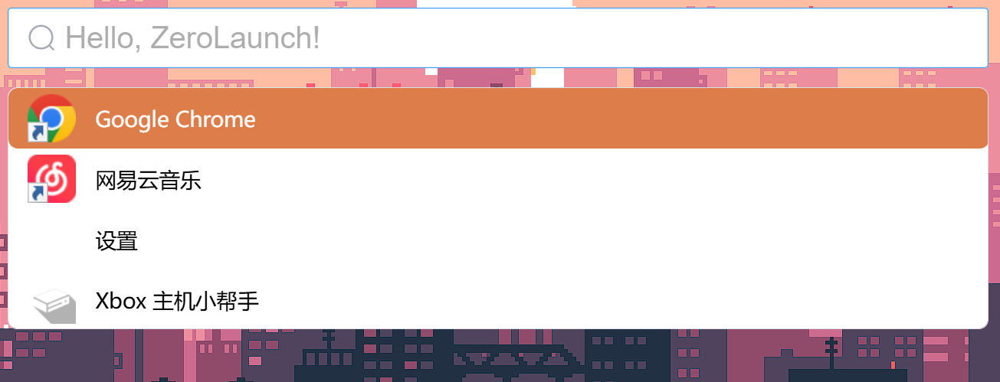
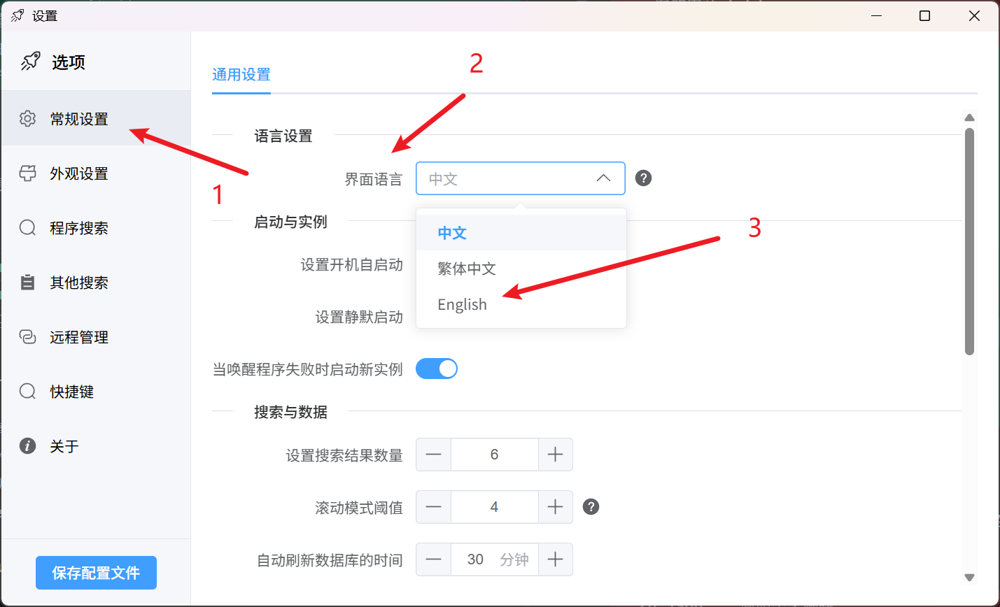

<div align="center">


[](https://www.gnu.org/licenses/gpl-3.0)
[](https://deepwiki.com/ghost-him/ZeroLaunch-rs)
[](https://github.com/ghost-him/ZeroLaunch-rs/releases)
[](https://github.com/ghost-him/ZeroLaunch-rs/graphs/commit-activity)
[](https://github.com/ghost-him/ZeroLaunch-rs/actions/workflows/ci.yml)

</div>

<div align="center">

[](https://gitee.com/ghost-him/ZeroLaunch-rs/stargazers)
[](https://gitee.com/ghost-him/ZeroLaunch-rs/members)
[](https://github.com/ghost-him/ZeroLaunch-rs/stargazers)
[](https://github.com/ghost-him/ZeroLaunch-rs/network/members)
[](https://codeberg.org/ghost-him/ZeroLaunch-rs)
[](https://gitcode.com/ghost-him/ZeroLaunch-rs/stargazers)
[](https://gitcode.com/ghost-him/ZeroLaunch-rs)

</div>

<div align="center">

[简体中文](README.md) | [繁體中文](readme-cn2.md) | [English](readme-en.md)

</div>


<div align="center">
    <a href="https://gitee.com/ghost-him/ZeroLaunch-rs" target="_blank">Gitee</a> •
    <a href="https://github.com/ghost-him/ZeroLaunch-rs" target="_blank">GitHub</a> •
    <a href="https://codeberg.org/ghost-him/ZeroLaunch-rs" target="_blank">Codeberg</a> •
    <a href="https://gitcode.com/ghost-him/ZeroLaunch-rs" target="_blank">GitCode</a> •
    <a href="https://zerolaunch.ghost-him.com" target="_blank">官网</a> •
    <a href="https://github.com/ghost-him/ZeroLaunch-rs/wiki" target="_blank">Wiki</a>
</div>

## 📕 一句话介绍

ZeroLaunch 是一款懂你输入习惯的 Windows 智能启动器。它精通拼音与模糊搜索，让错字、搜词都能秒速响应。纯净、离线，一切为高效而生。

> 市面上现有的启动器总有点不合我心意，索性自己造了一个。现在它已是我每天工作的得力助手，所以请放心，我不会跑路的～（最多是更新慢点 (～￣▽￣)～）

> ⚠️ **大规模重构中**：项目正在进行架构升级与插件系统重构，AI 语义搜索与 Everything 模式暂不可用，未来将以插件形式回归。当前版本功能尚不稳定，请谨慎使用。如使用最新代码构建时发现缺陷，欢迎提交 Issue（注意版本标识为 v1.0.0，而非已正式发布的 v0.x 版本）。

## 🖥️ 软件界面

[](asset/picture.md)

*点击图片查看完整功能截图集*

**背景图片可自定义**


## ✨ 特色亮点

### 🔒 隐私至上，完全离线
所有搜索与匹配均在本地完成，无需网络连接，坚持零数据采集。你的数据，永远只留在你的设备里。

### ⚡ 智能搜索，毫秒响应
- **强大匹配算法**：基于自研匹配算法，支持全称、拼音、首字母三重匹配与拼写纠错，高效且容错性高。
- **极致性能优化**：通过数据结构优化、分层缓存、按需加载与并发处理，确保即使在中低配设备上也能获得毫秒级响应体验。

> 💡 **想要深入了解搜索算法的实现原理？** 请参考 GitHub Wiki：[搜索介绍](https://github.com/ghost-him/ZeroLaunch-rs/wiki/%E6%90%9C%E7%B4%A2%E4%BB%8B%E7%BB%8D)

### 🌐 轻巧纯粹，开箱即用
专注于"快速、准确地启动"这一核心需求。默认设置已覆盖大多数使用场景，上手零成本；同时也为进阶用户提供了丰富的外观、行为与索引策略自定义选项，不加任何冗余功能。

## 🔧 核心功能一览

### 🎯 核心搜索与启动
*   **应用程序搜索**：快速检索并启动传统应用及 UWP 应用，支持备注与别名，识别本地化名称。
*   **应用程序唤醒**：智能将已运行程序的窗口置前，快速切换任务。
*   **打开文件所在目录**：通过右键菜单快速定位文件位置。

### 🎨 个性化与交互
*   **高度自定义外观**：支持自定义背景、颜色、字体、毛玻璃效果、圆角、窗口尺寸等，并提供便捷的调节按钮。
*   **多语言界面**：支持简体中文、繁体中文与英文，自动匹配系统语言。
*   **自定义快捷键**：所有核心操作快捷键均可按习惯重新映射。
*   **呼出位置跟随鼠标**：搜索栏会智能地在鼠标所在的显示器上弹出。

### ⚙️ 进阶与效率工具
*   **自定义索引项**：支持通过通配符或正则表达式添加程序、文件、网页与命令（如关机、打开特定设置页）。
*   **搜索算法微调**：可调整匹配算法参数，满足个性化需求。
*   **智能图标加载**：尽最大努力加载正确图标，完美支持 Steam 游戏。
*   **配置文件多端同步**：支持本地存储或通过 WebDAV 进行网络同步。
*   **开机自启与静默启动**：一键设置，启动即用。
*   **游戏模式**：可手动禁用快捷键，避免游戏时误触。
*   **最近启动程序**：按住 `Alt` 键可查看并快速打开最近使用的程序。
*   **结果显示优化**：可设置数量阈值，超出后自动切换为滚动显示。


## 🚀 快速入门

### 快捷键速查

| 功能                         | 快捷键                    |
| :--------------------------- | :------------------------ |
| 呼出/隐藏搜索栏              | `Alt + Space`             |
| 上下选择项目                 | `↑`/`↓` 或 `Ctrl + k`/`j` |
| 启动选中程序                 | `Enter`                   |
| 以管理员权限启动（普通应用） | `Ctrl + Enter`            |
| 清空搜索框                   | `Esc`                     |
| 隐藏搜索界面                 | 点击搜索框外部区域        |
| 切换到已打开的窗口           | `Shift + Enter`           |
| 按最近启动时间排序           | 按住 `Alt` 键             |

### 常见功能的实现

程序添加，文件添加，命令添加，搜索算法微调等功能的实现以及**常见的问题**的解决办法详见以下文档：[wiki](https://github.com/ghost-him/ZeroLaunch-rs/wiki)

文档写起来好麻烦，有时描述也不够直观 (っ °Д °;)っ。你也可以去 [DeepWiki](https://deepwiki.com/ghost-him/ZeroLaunch-rs) 看看，那里的讲解也许更清楚。

## 🚩 程序下载

### 使用 Winget 安装（推荐）
在终端中运行以下任一命令即可：
```bash
winget install zerolaunch
# 或
winget install ZeroLaunch-rs
# 或
winget install ghost-him.ZeroLaunch-rs
```

### 手动下载安装包
本项目采用 CI/CD 自动构建。新版本发布时，会自动构建 x64/arm64 版本，并同步至以下镜像，请选择访问最快的源下载：

*   **GitHub Releases** (全球用户推荐): [https://github.com/ghost-him/ZeroLaunch-rs/releases](https://github.com/ghost-him/ZeroLaunch-rs/releases)
*   **Codeberg Releases** (推荐): [https://codeberg.org/ghost-him/ZeroLaunch-rs/releases](https://codeberg.org/ghost-him/ZeroLaunch-rs/releases)
*   **Gitee Releases** (中国大陆用户推荐): [https://gitee.com/ghost-him/ZeroLaunch-rs/releases](https://gitee.com/ghost-him/ZeroLaunch-rs/releases)
*   **GitCode Releases** (中国大陆用户推荐): [https://gitcode.com/ghost-him/ZeroLaunch-rs/releases](https://gitcode.com/ghost-him/ZeroLaunch-rs/releases)

### 功能预告
以下功能正在进行插件化重构，将在后续版本中以插件形式回归：
- **AI 语义搜索** — 基于本地模型的自然语言检索
- **Everything 模式** — 文件系统路径快速搜索

## 🛠️ 开发者指南

详细的开发指南、环境配置、构建步骤以及贡献指南，请参考 [CONTRIBUTING.md](CONTRIBUTING.md)。

## 📦 数据目录结构

程序提供**安装版**与**便携版**两种形式，数据存储位置不同：
- **安装版**：数据存储在 `C:\Users\[用户名]\AppData\Roaming\ZeroLaunch-rs\`
- **便携版**：数据存储在软件同级目录下

### 本地数据目录结构

本地数据目录中存放以下文件：

```
本地数据目录/                            # 安装包版本：C:\Users\[用户名]\AppData\Roaming\ZeroLaunch-rs\
                                        # 便捷版：软件所在目录
├── logs/                               # 运行日志
├── icons/                              # 程序图标缓存
└── ZeroLaunch_local_config.json        # 本地配置文件，存储相关数据以及远程目录路径
```

### 远程目录结构

远程目录用于存放程序的详细运行配置，默认为当前的本地数据目录。通过远程存储可以实现两个机器间的数据同步。

```
远程目录/                               # 默认与本地数据目录相同
├── background.png                      # 自定义背景图片
└── ZeroLaunch_remote_config.json       # 远程配置文件，存储程序运行配置
```

## ⚠️ 已知限制

*   **短词搜索**：当输入字符数少于 3 个时，搜索结果可能不够精确。

## 🌍 语言支持

当前支持：简体中文 (zh-Hans)、繁体中文 (zh-Hant)、English (en)。

### 切换语言

1.  打开 ZeroLaunch 设置。
2.  进入「General」 -> 「Language Settings」。
3.  在「Interface language」下拉菜单中选择所需语言。
4.  点击「Save Config」保存。



> ZeroLaunch-rs 在初次启动时会自动检测当前系统使用的语言并选择合适的语言

### 贡献翻译

我们非常欢迎社区帮助翻译更多语言！翻译文件位于 `src-ui/i18n/locales/` 目录。若要添加新语言，请：
1.  复制一份现有翻译文件（如 `en.json`）。
2.  重命名为目标语言代码（如 `fr.json`）。
3.  翻译所有文本内容。
4.  提交 Pull Request。

感谢你帮助 ZeroLaunch 走向世界！🙏

## ✍️ 代码签名

代码签名由 SignPath 提供，详情请见 [代码签名](CODE_SIGNING.md)

### 隐私声明
除非用户明确要求，否则本程序不会向任何外部系统传输信息。详情请见 [隐私政策](PRIVACY.md)。

## 🤝 开源致谢

本项目基于以下优秀开源项目构建：

* [chinese-xinhua](https://github.com/pwxcoo/chinese-xinhua) - 中文转拼音核心词典
* [LaunchyQt](https://github.com/samsonwang/LaunchyQt) - UWP应用索引方案
* [bootstrap](https://icons.bootcss.com/) - 提供了部分的程序图标
* [icon-icons](https://icon-icons.com/zh/) - 提供了部分的程序图标
* [Follower-v2.0](https://github.com/MrBeanCpp/Follower-v2.0) - 提供了全屏检测的方案

## 💝 赞助商

感谢以下赞助商对 ZeroLaunch-rs 的大力支持，让项目变得更好 (´▽´ʃ♡ƪ)

<table>
  <tr>
    <td width="60" align="center" valign="middle">
      <a href="https://signpath.io" target="_blank" rel="noopener noreferrer">
        
      </a>
    </td>
    <td align="left" valign="middle">
      Windows 平台的免费代码签名由 <a href="https://signpath.io" target="_blank" rel="noopener noreferrer"><b>SignPath.io</b></a> 提供，证书由 <a href="https://signpath.org" target="_blank" rel="noopener noreferrer"><b>SignPath Foundation</b></a> 提供。
    </td>
  </tr>
</table>

## ❤️ 支持作者

如果你喜欢 ZeroLaunch-rs，可以通过以下方式支持我们：

1. 点一个免费的小星星⭐
2. 把这个项目分享给其他感兴趣的朋友
3. 提出更多改进的建议（ZeroLaunch-rs 的定位就是纯粹的程序启动器，所以只会专注于启动器的功能，不会添加太多无关的功能哦，请谅解🥺🙏）

> 本项目目前**仅主动优化核心搜索启动功能**，其他功能不在优先级之内。如果你有功能需求或发现 bug，欢迎提交 Issue。我会定期查看反馈，并根据实际情况进行优化和修复。感谢你的理解与支持！

[](https://www.star-history.com/#ghost-him/zerolaunch-rs&Date)
