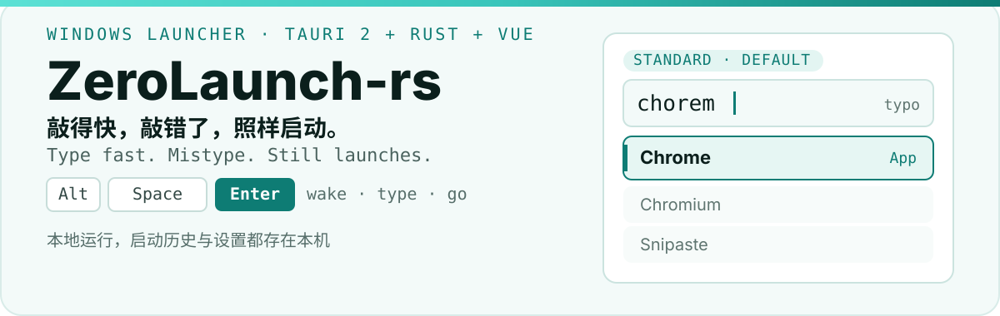
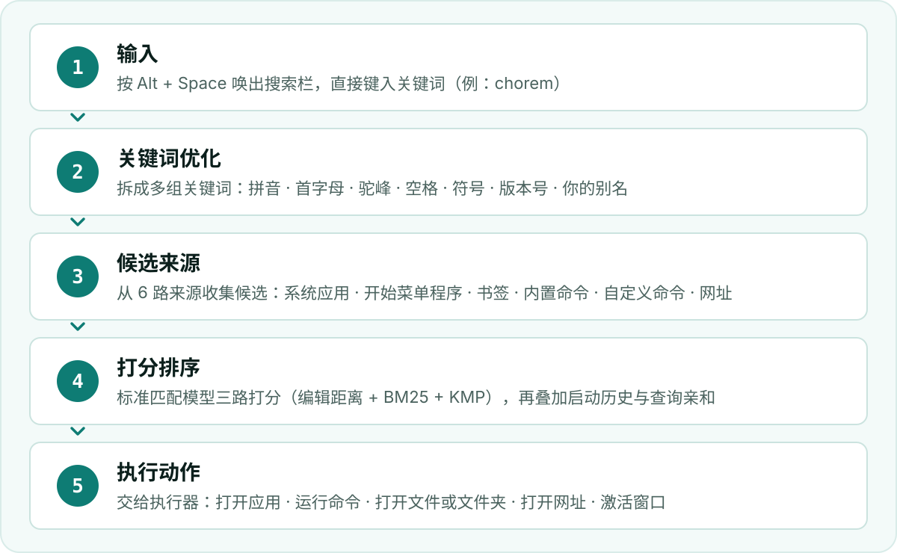

  <strong>简体中文</strong> · <a href="./README.zh-TW.md">繁體中文</a> · <a href="./README.en.md">English</a>

<h1 align="center">
  <picture>
    <source media="(prefers-color-scheme: dark)" srcset="./assets/readme/hero-dark.svg">
    
  </picture>
</h1>

  
  
  
  

  <strong>ZeroLaunch-rs 是一个为 Windows 打造的键盘启动器。</strong> 
  给习惯用键盘的人：按 <kbd>Alt</kbd>+<kbd>Space</kbd> 唤出，敲几个字母，<kbd>Enter</kbd> 启动； 
  手快打错了也没关系——你要找的那个，多半还在第一位。

  <a href="https://github.com/ghost-him/ZeroLaunch-rs/releases/latest"><strong>下载最新版</strong></a>

  <a href="#proof">敲错也能命中</a> ·
  <a href="#quickstart">60 秒上手</a> ·
  <a href="#capabilities">核心能力</a> ·
  <a href="#how">怎么做到</a> ·
  <a href="#extend">扩展</a> ·
  <a href="#contribute">贡献</a>

  <picture>
    <source media="(prefers-color-scheme: dark)" srcset="./assets/readme/section-proof-dark.svg">
    
  </picture>

## 敲错也能命中

如果你打字很快，大概遇到过这种失败：想搜 `chrome`，手指一快打成了 `chorem`，结果列表空空如也，明明装着的应用一个都不出来。

ZeroLaunch-rs 默认的匹配算法就是冲着这件事写的。它给每个结果打三路分：看你敲的字母差了几个、看字母组合像不像、看开头和中间的字母对不对得上。错一两个字母、或者两个字母敲反了，分数只是低一点，而不是直接掉到零。

`chorem` 和 `chrome` 只差一次相邻字母交换，所以这种情况下第一条结果依然是 Chrome。下面是实际运行时的样子（录屏：先正常搜 `ch`、`stea`，再把 `chrome` 敲乱成 `chormfe`、`vhcomre`）：

  

> 不吹准确率百分比——敲错一个字母，按一次 <kbd>Enter</kbd> 试试就知道了。

  <picture>
    <source media="(prefers-color-scheme: dark)" srcset="./assets/readme/section-start-dark.svg">
    
  </picture>

## 60 秒上手

1. **装**：到 [Releases](https://github.com/ghost-him/ZeroLaunch-rs/releases) 下载文件名带 `x64` 的 `.msi`，双击装完即可（只有 ARM 笔记本要选带 `arm64` 的）。
2. **或者用便携版**：下载文件名带 `x64` 的 `ZeroLaunch-portable-…` `.zip`，解压后运行里面的 `exe`。

用起来就三步：按 <kbd>Alt</kbd>+<kbd>Space</kbd> 唤出 → 敲几个字母 → <kbd>Enter</kbd> 打开。第一个结果默认选中，所以这三步就够了。

数据在 `C:\Users\你的用户名\.ZeroLaunch-rs\`（便携版全放在 `exe` 旁边）；不上传你的使用数据，详见 [PRIVACY.md](./PRIVACY.md)；不需要时删掉这个文件夹再卸载即可。

<strong>完整操作说明：全部按键</strong>

### 唤出与收起

| 按键 | 作用 |
|---|---|
| <kbd>Alt</kbd>+<kbd>Space</kbd> | 唤出搜索窗。这是默认键，可以在设置里换成别的组合，也可以改成「双击 <kbd>Ctrl</kbd>」。 |
| <kbd>Esc</kbd> | 输入框里有内容就清空；空的时候收起窗口。打开设置里的「ESC 优先隐藏」后，一律直接收窗。 |
| 面板里的 <kbd>Esc</kbd> | 先退出面板、回到普通搜索；再按一次才收窗。 |

### 搜索列表

| 按键 | 作用 |
|---|---|
| <kbd>↓</kbd> / <kbd>↑</kbd> | 上下移动选中项。 |
| <kbd>Ctrl</kbd>+<kbd>J</kbd> <kbd>Ctrl</kbd>+<kbd>K</kbd> | 也是上下移动，默认的「向下选择键 / 向上选择键」，可在设置里改；两个都清空后只剩方向键。 |
| <kbd>Enter</kbd> | 执行选中的条目。 |
| <kbd>Ctrl</kbd>+<kbd>1</kbd>…<kbd>9</kbd> | 执行选中条目的第 N 个动作（主键盘数字区）。 |
| 条目自带的快捷键 | 有些条目会声明自己的快捷键，直接印在动作按钮上——路径与程序条目的「以管理员身份运行」是 <kbd>Ctrl</kbd>+<kbd>Enter</kbd>，「唤醒窗口」是 <kbd>Shift</kbd>+<kbd>Enter</kbd>；按下即执行那个动作。 |
| <kbd>Tab</kbd> <kbd>Shift</kbd>+<kbd>Tab</kbd> | 在选中条目的动作之间向后 / 向前循环。 |
| <kbd>Home</kbd> / <kbd>End</kbd> | 跳到第一条 / 最后一条。 |
| 空格 | 平常就是输入空格；开启设置里的「空格键确认」后等同于 <kbd>Enter</kbd>。 |
| 鼠标 | 单击条目直接执行；单击条目上的动作按钮只执行那个动作。 |

### 需要填参数的条目（比如自建命令）

| 按键 | 作用 |
|---|---|
| <kbd>Enter</kbd> | 确认参数并执行。 |
| <kbd>Tab</kbd> <kbd>Shift</kbd>+<kbd>Tab</kbd> | 参数多于一个时，切到下一个 / 上一个字段。 |
| <kbd>Ctrl</kbd>+<kbd>J</kbd> <kbd>Ctrl</kbd>+<kbd>K</kbd> | 上下移动选中项（这时方向键留给输入框的光标）。 |
| <kbd>Backspace</kbd> | 参数还空着时，退出参数输入。 |
| <kbd>Esc</kbd> | 退出参数输入。 |

### 插件面板里

面板按键由插件自己声明，下面是自带的几个：

| 面板 | 按键 |
|---|---|
| 翻译 | <kbd>Enter</kbd> 复制译文（还没译好时触发翻译或重试）；<kbd>Ctrl</kbd>+<kbd>Enter</kbd> 直接复制已有译文；<kbd>Esc</kbd> 退出面板。 |
| 算数 | <kbd>Enter</kbd> 复制结果（没有结果时重算）；<kbd>Esc</kbd> 退出。 |
| 路径 网址 | <kbd>Enter</kbd> 打开；其余动作（如「打开所在文件夹」）用鼠标点；<kbd>Esc</kbd> 退出回搜索。 |

插件面板走的是「全接管」模型：面板里需要哪些键，全由插件自己声明，宿主只解释它声明过的那几个，剩下的按键一概放行给它。所以某个键在某个面板里没反应，通常是这个插件没声明它——这种情况属于插件自身的问题，请直接向该插件的作者反馈。

### 插件热键

独立插件可以自带一个热键（例如 <kbd>Ctrl</kbd>+<kbd>E</kbd>）：搜索窗已经打开时按下，直接进这个插件的面板。它不会注册成系统级全局热键，所以窗口没打开时按不到。热键和别的插件撞车时，只有优先级高的那个生效。

  <picture>
    <source media="(prefers-color-scheme: dark)" srcset="./assets/readme/section-capabilities-dark.svg">
    
  </picture>

## 核心能力

唤出之后就是一个输入框。你敲进去的可以是「东西本身」——应用名、文件夹路径、网址、算式；也可以是「触发词 + 内容」，比如 `fy 你好`。前者交给搜索，后者交给插件（插件有哪两种、自带的都有什么，见下方折叠的「插件」小节）。

- **搜到就能启动**：系统里装的应用（含从微软商店装的）、开始菜单里的程序、你自己加的条目，都在同一个输入框里；打开时用的是系统默认程序，跟双击一样。
- **打错也能找到**：敲错一两个字母、或者把两个字母敲反了，列表也不会空，你要找的那个多半还在最前面。
- **越用越顺**：常用、最近用过的条目会自动往前排；这些记录单独存一个文件，重启不丢，也不会混进你的配置文件。
- **按习惯定制**：起别名、加自定义命令和网址、改快捷键、换界面语言，都在设置里完成。
- **配置都有界面**：从唤出快捷键、主题配色、字体，到每个插件自己的参数（翻译用哪个模型、默认译成什么语言），每一项都有对应控件：热键按下即录、颜色有取色器、路径与字体有选择列表、数值有步进器。不用打开任何配置文件，改坏了还能一键恢复默认。

<strong>插件：两种形态与内置插件清单</strong>

插件按唤醒方式分两种。**行内插件**（inline）在你输入的时候接管，结果嵌在搜索窗口里；**独立插件**（panel）不接管输入，而是自己变成一个候选，选中之后整页接管。

行内插件有两种玩法。一种是**替换内置部件**：插件可以声明自己实现搜索引擎、候选来源、执行动作、打分规则、关键词处理这几个位置，和内置组件完全对等，装上就顶掉内置那一份。另一种是**自带一套交互**：翻译、算数就属于这种——你敲 `fy 你好` 或者 `= 12*8`，结果区就换成它的面板，搜索栏还在。路径和网址连触发词都不用，靠形态判定：让它知道「就是这个」的办法是在末尾敲一个空格（例如 `github.com `），路径本身含空格时用引号整段包住（例如 `"C:\Program Files"`）。

独立插件的触发词会变成候选关键字。你输入这个词，列表里就多出这个插件，回车之后它占满整个窗口、不留搜索栏；这类插件还能注册一个全局热键，一键直接打开。

自带的插件不用额外装什么就能用，不想要哪个可以在设置里单独关掉：

- **应用搜索**：`chrome` 启动应用（`微信` 直接搜中文，`qqy` 直接搜 QQ音乐）。
- **路径与网址**：`D:\下载 ` 打开文件夹，`github.com ` 打开网址（末尾空格表示「就是它」；含空格的路径用引号包住）。
- **计算器**：`= 12*8` 直接出结果。
- **翻译**：以 `fy`、`tr` 或 `翻译` 开头，可以边打边译，也可以回车才译；第一次用要先在设置里配好一个聊天模型（本机 Ollama 或 OpenAI 兼容接口都行），没配就出不来结果。
- **书签搜索**：自动读取 Chrome、Edge 等浏览器的书签，敲书签标题就能打开。
- **内置命令**：敲 `设置` / `刷新` / `注册` / `游戏` / `退出`，分别打开设置、重建索引、重新注册快捷键、切换游戏模式、退出程序。
- **自定义命令与网址**：把常用内容存成自己的条目，下次敲关键词直接运行或打开。

  <picture>
    <source media="(prefers-color-scheme: dark)" srcset="./assets/readme/section-how-dark.svg">
    
  </picture>

## 怎么做到

  <picture>
    <source media="(prefers-color-scheme: dark)" srcset="./assets/readme/pipeline-dark.svg">
    
  </picture>

从按下 <kbd>Alt</kbd>+<kbd>Space</kbd> 到打开目标，中间要经过一条管线：先把你的输入拆成几组关键词，再从各个来源收集候选，由匹配算法打分，叠加你的使用习惯，最后交给执行器执行。这条管线里的每一段都能整体替换——换搜索引擎、换数据来源、换加分规则、换执行方式都可以。

<strong>默认参数（都能在设置里调）</strong>

- 匹配算法由三路组成：最短编辑距离、字符 bigram 上的 BM25 稀有度加权、KMP 首字符与子串匹配。
- 标准模型：BM25 `k1 = 1.2`、`b = 0.3`（应用名短、长度方差小，所以比经典 `0.75` 低），分数再经 `3·log2(score+1)` 放大。
- 习惯加分：启动历史 `0.8`、近期习惯 `1.5`、时间 `0.5`、衰减 `10800` 秒（约 3 小时）；查询亲和权重 `3.0`、衰减 `259200` 秒（约 3 天）、冷却 `15` 秒。
- 内置三个搜索引擎：标准（默认）、Launchy 风格、skim 风格。
- 设置里的调试页能看到每次查询的耗时与各组件分数明细。

  <picture>
    <source media="(prefers-color-scheme: dark)" srcset="./assets/readme/section-extend-dark.svg">
    
  </picture>

## 扩展

- **第三方插件**：除了自带的，还能装别人写好的，也可以自己写。每个插件都在独立进程里跑，插件崩了不会带走主程序；双方按固定协议对话，版本对不上就直接拒绝加载。
- **插件市场**：在软件里就能逛社区插件，点一下就能装，装完立刻能用。
- **Rust SDK**：官方提供 SDK，见 [`crates/plugin-sdk-rust`](./crates/plugin-sdk-rust/README.md)。实现 `Plugin`（`init` / `query` / `execute_action`）和 `Configurable`，用 `run(MyPlugin)` 就能跑起来，需要用到宿主能力时调 `HostProxy`；完整的 trait 清单与协议说明见 [`crates/plugin-api/README.md`](./crates/plugin-api/README.md)。
- **本地 CLI**：给 AI 编程助手或脚本用。到 [Releases](https://github.com/ghost-him/ZeroLaunch-rs/releases) 附件里下载 `zerolaunch-cli_<版本>_<架构>.exe`，改名成 `zl.exe` 即可（它自己的命令名就是 `zl`）。子命令有 `ping`、`query`、`session`、`plugins`、`config`，加 `-j` 输出 JSON。

  <picture>
    <source media="(prefers-color-scheme: dark)" srcset="./assets/readme/section-contribute-dark.svg">
    
  </picture>

## 贡献

遇到问题、发现 bug，或者只是想说点什么，欢迎[提 issue](https://github.com/ghost-him/ZeroLaunch-rs/issues)，也欢迎来 [discussions](https://github.com/ghost-him/ZeroLaunch-rs/discussions) 聊聊。

想动手改代码，请先读 [CONTRIBUTING.md](./CONTRIBUTING.md)，里面写了：

- 本地怎么跑起来：环境要求、依赖安装、开发与调试命令；
- 提交前要过哪些检查：格式化、静态检查、测试；
- 提交信息与 PR 的规范（Conventional Commits）。

## 💝 赞助商

感谢以下赞助商对 ZeroLaunch-rs 的大力支持，让项目变得更好 (´▽´ʃ♡ƪ)

<table>
  <tr>
    <td width="60" align="center" valign="middle">
      
    </td>
    <td align="left" valign="middle">
      Windows 平台的免费代码签名由 <a href="https://signpath.io" target="_blank" rel="noopener noreferrer"><b>SignPath.io</b></a> 提供，证书由 <a href="https://signpath.org" target="_blank" rel="noopener noreferrer"><b>SignPath Foundation</b></a> 提供。
    </td>
  </tr>
</table>

## 许可证

主程序 `GPL-3.0-only`，见 [`LICENSE.txt`](./LICENSE.txt)。插件用的 SDK（`zerolaunch-plugin-api`、`zerolaunch-plugin-host`、`zerolaunch-plugin-sdk-rust` 等）单独采用 `Apache-2.0`，所以你写的第三方插件不受主程序许可证的限制。

  <strong>简体中文</strong> · <a href="./README.zh-TW.md">繁體中文</a> · <a href="./README.en.md">English</a>

