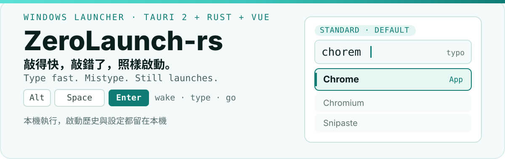
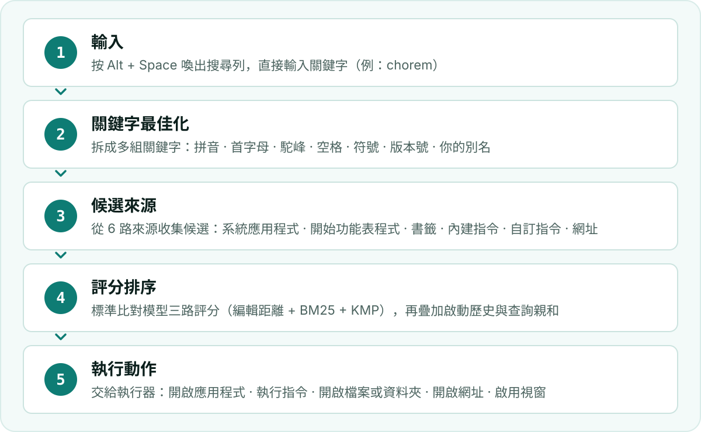

  <a href="./README.md">简体中文</a> · <strong>繁體中文</strong> · <a href="./README.en.md">English</a>

<h1 align="center">
  <picture>
    <source media="(prefers-color-scheme: dark)" srcset="./assets/readme/hero-zh-TW-dark.svg">
    
  </picture>
</h1>

  
  
  
  

  <strong>ZeroLaunch-rs 是一個為 Windows 打造的鍵盤啟動器。</strong> 
  給習慣用鍵盤的人：按 <kbd>Alt</kbd>+<kbd>Space</kbd> 喚出，敲幾個字母，<kbd>Enter</kbd> 啟動； 
  手快打錯了也沒關係——你要找的那個，多半還在第一位。

  <a href="https://github.com/ghost-him/ZeroLaunch-rs/releases/latest"><strong>下載最新版</strong></a>

  <a href="#proof">敲錯也能命中</a> ·
  <a href="#quickstart">60 秒上手</a> ·
  <a href="#capabilities">核心能力</a> ·
  <a href="#how">怎麼做到</a> ·
  <a href="#extend">擴充</a> ·
  <a href="#contribute">貢獻</a>

  <picture>
    <source media="(prefers-color-scheme: dark)" srcset="./assets/readme/section-proof-dark.svg">
    
  </picture>

## 敲錯也能命中

如果你打字很快，大概遇過這種失敗：想搜 `chrome`，手指一快打成了 `chorem`，結果清單空空如也，明明裝著的應用一個都不出來。

ZeroLaunch-rs 預設的匹配演算法就是衝著這件事寫的。它給每個結果打三路分：看你敲的字母差了幾個、看字母組合像不像、看開頭和中間的字母對不對得上。錯一兩個字母、或者兩個字母敲反了，分數只是低一點，而不是直接掉到零。

`chorem` 和 `chrome` 只差一次相鄰字母互換，所以這種情況下第一條結果依然是 Chrome。下面是實際執行時的樣子（錄影：先正常搜 `ch`、`stea`，再把 `chrome` 敲亂成 `chormfe`、`vhcomre`）：

  

> 不吹準確率百分比——敲錯一個字母，按一次 <kbd>Enter</kbd> 試試就知道了。

  <picture>
    <source media="(prefers-color-scheme: dark)" srcset="./assets/readme/section-start-dark.svg">
    
  </picture>

## 60 秒上手

1. **裝**：到 [Releases](https://github.com/ghost-him/ZeroLaunch-rs/releases) 下載檔名帶 `x64` 的 `.msi`，雙擊裝完即可（只有 ARM 筆電要選帶 `arm64` 的）。
2. **或者用可攜版**：下載檔名帶 `x64` 的 `ZeroLaunch-portable-…` `.zip`，解壓後執行裡面的 `exe`。

用起來就三步：按 <kbd>Alt</kbd>+<kbd>Space</kbd> 喚出 → 敲幾個字母 → <kbd>Enter</kbd> 開啟。第一個結果預設選中，所以這三步就夠了。

資料在 `C:\Users\你的使用者名稱\.ZeroLaunch-rs\`（可攜版全放在 `exe` 旁邊）；不上傳你的使用資料，詳見 [PRIVACY.md](./PRIVACY.md)；不需要時刪掉這個資料夾再解除安裝即可。

<strong>完整操作說明：全部按鍵</strong>

### 喚出與收起

| 按鍵 | 作用 |
|---|---|
| <kbd>Alt</kbd>+<kbd>Space</kbd> | 喚出搜尋窗。這是預設鍵，可以在設定裡換成別的組合，也可以改成「雙擊 <kbd>Ctrl</kbd>」。 |
| <kbd>Esc</kbd> | 輸入框裡有內容就清空；空的時候收起視窗。開啟設定裡的「ESC 優先隱藏」後，一律直接收窗。 |
| 面板裡的 <kbd>Esc</kbd> | 先退出面板、回到普通搜尋；再按一次才收窗。 |

### 搜尋清單

| 按鍵 | 作用 |
|---|---|
| <kbd>↓</kbd> / <kbd>↑</kbd> | 上下移動選中項。 |
| <kbd>Ctrl</kbd>+<kbd>J</kbd> <kbd>Ctrl</kbd>+<kbd>K</kbd> | 也是上下移動，預設的「向下選擇鍵 / 向上選擇鍵」，可在設定裡改；兩個都清空後只剩方向鍵。 |
| <kbd>Enter</kbd> | 執行選中的條目。 |
| <kbd>Ctrl</kbd>+<kbd>1</kbd>…<kbd>9</kbd> | 執行選中條目的第 N 個動作（主鍵盤數字區）。 |
| 條目自帶的快速鍵 | 有些條目會宣告自己的快速鍵，直接印在動作按鈕上——路徑與程式條目的「以管理員身分執行」是 <kbd>Ctrl</kbd>+<kbd>Enter</kbd>，「喚醒視窗」是 <kbd>Shift</kbd>+<kbd>Enter</kbd>；按下即執行那個動作。 |
| <kbd>Tab</kbd> <kbd>Shift</kbd>+<kbd>Tab</kbd> | 在選中條目的動作之間向後 / 向前循環。 |
| <kbd>Home</kbd> / <kbd>End</kbd> | 跳到第一條 / 最後一條。 |
| 空格 | 平常就是輸入空格；開啟設定裡的「空格鍵確認」後等同於 <kbd>Enter</kbd>。 |
| 滑鼠 | 單擊條目直接執行；單擊條目上的動作按鈕只執行那個動作。 |

### 需要填參數的條目（比如自建指令）

| 按鍵 | 作用 |
|---|---|
| <kbd>Enter</kbd> | 確認參數並執行。 |
| <kbd>Tab</kbd> <kbd>Shift</kbd>+<kbd>Tab</kbd> | 參數多於一個時，切到下一個 / 上一個欄位。 |
| <kbd>Ctrl</kbd>+<kbd>J</kbd> <kbd>Ctrl</kbd>+<kbd>K</kbd> | 上下移動選中項（這時方向鍵留給輸入框的游標）。 |
| <kbd>Backspace</kbd> | 參數還空著時，退出參數輸入。 |
| <kbd>Esc</kbd> | 退出參數輸入。 |

### 外掛面板裡

面板按鍵由外掛自己宣告，下面是自帶的幾個：

| 面板 | 按鍵 |
|---|---|
| 翻譯 | <kbd>Enter</kbd> 複製譯文（還沒譯好時觸發翻譯或重試）；<kbd>Ctrl</kbd>+<kbd>Enter</kbd> 直接複製已有譯文；<kbd>Esc</kbd> 退出面板。 |
| 算數 | <kbd>Enter</kbd> 複製結果（沒有結果時重算）；<kbd>Esc</kbd> 退出。 |
| 路徑 網址 | <kbd>Enter</kbd> 開啟；其餘動作（如「開啟所在資料夾」）用滑鼠點；<kbd>Esc</kbd> 退出回搜尋。 |

外掛面板走的是「全接管」模型：面板裡需要哪些鍵，全由外掛自己宣告，宿主只解釋它宣告過的那幾個，剩下的按鍵一概放行給它。所以某個鍵在某個面板裡沒反應，通常是這個外掛沒宣告它——這種情況屬於外掛自身的問題，請直接向該外掛的作者回饋。

### 外掛熱鍵

獨立外掛可以自帶一個熱鍵（例如 <kbd>Ctrl</kbd>+<kbd>E</kbd>）：搜尋窗已經開啟時按下，直接進這個外掛的面板。它不會註冊成系統級全域熱鍵，所以視窗沒開啟時按不到。熱鍵和別的外掛撞車時，只有優先級高的那個生效。

  <picture>
    <source media="(prefers-color-scheme: dark)" srcset="./assets/readme/section-capabilities-dark.svg">
    
  </picture>

## 核心能力

喚出之後就是一個輸入框。你敲進去的可以是「東西本身」——應用名、資料夾路徑、網址、算式；也可以是「觸發詞 + 內容」，比如 `fy 你好`。前者交給搜尋，後者交給外掛（外掛有哪兩種、自帶的都有什麼，見下方折疊的「外掛」小節）。

- **搜到就能啟動**：系統裡裝的應用（含從 Microsoft Store 裝的）、開始功能表裡的程式、你自己加的條目，都在同一個輸入框裡；開啟時用的是系統預設程式，跟雙擊一樣。
- **打錯也能找到**：敲錯一兩個字母、或者把兩個字母敲反了，清單也不會空，你要找的那個多半還在最前面。
- **越用越順**：常用、最近用過的條目會自動往前排；這些記錄單獨存一個檔案，重啟不丟，也不會混進你的設定檔。
- **按習慣自訂**：取別名、加自訂指令和網址、改快速鍵、換介面語言，都在設定裡完成。
- **設定都有介面**：從喚出快速鍵、主題配色、字型，到每個外掛自己的參數（翻譯用哪個模型、預設譯成什麼語言），每一項都有對應控件：熱鍵按下即錄、顏色有取色器、路徑與字型有選擇清單、數值有步進器。不用開啟任何設定檔，改壞了還能一鍵恢復預設。

<strong>外掛：兩種形態與內建外掛清單</strong>

外掛按喚醒方式分兩種。**行內外掛**（inline）在你輸入的時候接管，結果嵌在搜尋視窗裡；**獨立外掛**（panel）不接管輸入，而是自己變成一個候選，選中之後整頁接管。

行內外掛有兩種玩法。一種是**替換內建部件**：外掛可以宣告自己實作搜尋引擎、候選來源、執行動作、評分規則、關鍵字處理這幾個位置，和內建組件完全對等，裝上就頂掉內建那一份。另一種是**自帶一套互動**：翻譯、算數就屬於這種——你敲 `fy 你好` 或者 `= 12*8`，結果區就換成它的面板，搜尋列還在。路徑和網址連觸發詞都不用，靠形態判定：讓它知道「就是這個」的辦法是在末尾敲一個空格（例如 `github.com `），路徑本身含空格時用引號整段包住（例如 `"C:\Program Files"`）。

獨立外掛的觸發詞會變成候選關鍵字。你輸入這個詞，清單裡就多出這個外掛，Enter 之後它佔滿整個視窗、不留搜尋列；這類外掛還能註冊一個全域熱鍵，一鍵直接開啟。

自帶的外掛不用額外裝什麼就能用，不想要哪個可以在設定裡單獨關掉：

- **應用搜尋**：`chrome` 啟動應用（`微信` 直接搜中文，`qqy` 直接搜 QQ 音樂）。
- **路徑與網址**：`D:\下載 ` 開啟資料夾，`github.com ` 開啟網址（末尾空格表示「就是它」；含空格的路徑用引號包住）。
- **計算機**：`= 12*8` 直接出結果。
- **翻譯**：以 `fy`、`tr` 或 `翻译`（簡體字面關鍵字）開頭，可以邊打邊譯，也可以 Enter 才譯；第一次用要先在設定裡配好一個聊天模型（本機 Ollama 或 OpenAI 相容介面都行），沒配就出不來結果。
- **書籤搜尋**：自動讀取 Chrome、Edge 等瀏覽器的書籤，敲書籤標題就能開啟。
- **內建指令**：輸入 `settings` / `refresh` / `reshortcut` / `gamemode` / `exit`（程式內建的中文關鍵字是簡體字面值 `设置` / `刷新` / `注册` / `游戏` / `退出`，照打即可），分別開啟設定、重建索引、重新註冊快速鍵、切換遊戲模式、離開程式。
- **自訂指令與網址**：把常用內容存成自己的條目，下次敲關鍵字直接執行或開啟。

  <picture>
    <source media="(prefers-color-scheme: dark)" srcset="./assets/readme/section-how-dark.svg">
    
  </picture>

## 怎麼做到

  <picture>
    <source media="(prefers-color-scheme: dark)" srcset="./assets/readme/pipeline-zh-TW-dark.svg">
    
  </picture>

從按下 <kbd>Alt</kbd>+<kbd>Space</kbd> 到開啟目標，中間要經過一條管線：先把你的輸入拆成幾組關鍵字，再從各個來源收集候選，由匹配演算法評分，疊加你的使用習慣，最後交給執行器執行。這條管線裡的每一段都能整體替換——換搜尋引擎、換資料來源、換加分規則、換執行方式都可以。

<strong>預設參數（都能在設定裡調）</strong>

- 匹配演算法由三路組成：最短編輯距離、字元 bigram 上的 BM25 稀有度加權、KMP 首字元與子字串匹配。
- 標準模型：BM25 `k1 = 1.2`、`b = 0.3`（應用名短、長度變異小，所以比經典 `0.75` 低），分數再經 `3·log2(score+1)` 放大。
- 習慣加分：啟動歷史 `0.8`、近期習慣 `1.5`、時間 `0.5`、衰減 `10800` 秒（約 3 小時）；查詢親和權重 `3.0`、衰減 `259200` 秒（約 3 天）、冷卻 `15` 秒。
- 內建三個搜尋引擎：標準（預設）、Launchy 風格、skim 風格。
- 設定裡的除錯頁能看到每次查詢的耗時與各組件分數明細。

  <picture>
    <source media="(prefers-color-scheme: dark)" srcset="./assets/readme/section-extend-dark.svg">
    
  </picture>

## 擴充

- **第三方外掛**：除了自帶的，還能裝別人寫好的，也可以自己寫。每個外掛都在獨立行程裡跑，外掛崩了不會帶走主程式；雙方按固定協定對話，版本對不上就直接拒絕載入。
- **外掛市集**：在軟體裡就能逛社群外掛，點一下就能裝，裝完立刻能用。
- **Rust SDK**：官方提供 SDK，見 [`crates/plugin-sdk-rust`](./crates/plugin-sdk-rust/README.md)。實作 `Plugin`（`init` / `query` / `execute_action`）和 `Configurable`，用 `run(MyPlugin)` 就能跑起來，需要用到宿主能力時調 `HostProxy`；完整的 trait 清單與協定說明見 [`crates/plugin-api/README.md`](./crates/plugin-api/README.md)。
- **本機 CLI**：給 AI 程式助手或腳本用。到 [Releases](https://github.com/ghost-him/ZeroLaunch-rs/releases) 附件裡下載 `zerolaunch-cli_<版本>_<架構>.exe`，改名成 `zl.exe` 即可（它自己的指令名就是 `zl`）。子指令有 `ping`、`query`、`session`、`plugins`、`config`，加 `-j` 輸出 JSON。

  <picture>
    <source media="(prefers-color-scheme: dark)" srcset="./assets/readme/section-contribute-dark.svg">
    
  </picture>

## 貢獻

遇到問題、發現 bug，或者只是想說點什麼，歡迎[提 issue](https://github.com/ghost-him/ZeroLaunch-rs/issues)，也歡迎來 [discussions](https://github.com/ghost-him/ZeroLaunch-rs/discussions) 聊聊。

想動手改程式，請先讀 [CONTRIBUTING.md](./CONTRIBUTING.md)，裡面寫了：

- 本機怎麼跑起來：環境需求、依賴安裝、開發與除錯指令；
- 提交前要過哪些檢查：格式化、靜態檢查、測試；
- 提交訊息與 PR 的規範（Conventional Commits）。

## 💝 贊助商

感謝以下贊助商對 ZeroLaunch-rs 的大力支持，讓專案變得更好 (´▽´ʃ♡ƪ)

<table>
  <tr>
    <td width="60" align="center" valign="middle">
      
    </td>
    <td align="left" valign="middle">
      Windows 平台的免費程式碼簽章由 <a href="https://signpath.io" target="_blank" rel="noopener noreferrer"><b>SignPath.io</b></a> 提供，憑證由 <a href="https://signpath.org" target="_blank" rel="noopener noreferrer"><b>SignPath Foundation</b></a> 提供。
    </td>
  </tr>
</table>

## 授權條款

主程式 `GPL-3.0-only`，見 [`LICENSE.txt`](./LICENSE.txt)。外掛用的 SDK（`zerolaunch-plugin-api`、`zerolaunch-plugin-host`、`zerolaunch-plugin-sdk-rust` 等）單獨採用 `Apache-2.0`，所以你寫的第三方外掛不受主程式授權條款的限制。

  <a href="./README.md">简体中文</a> · <strong>繁體中文</strong> · <a href="./README.en.md">English</a>

