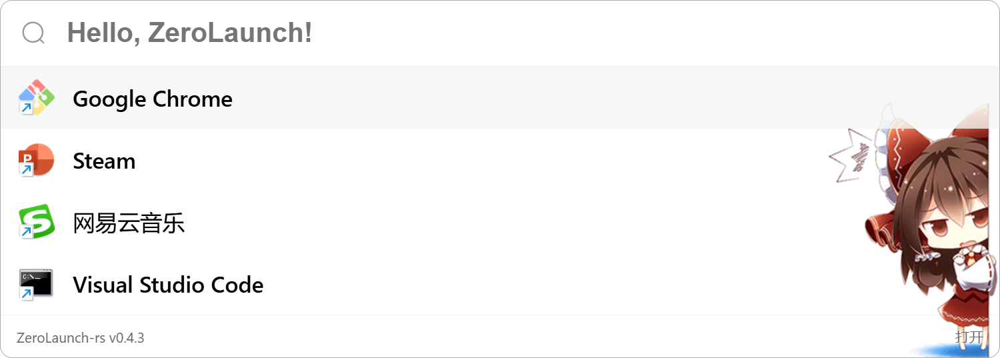

主介面

精準匹配

模糊匹配

拼音匹配

**拼音匹配也支援模糊匹配**
假設要輸入 `wy` 時，手指同時按下了 `y` 與 `u`，打出了 `wyu` 的情況

自訂背景

圖片來源：[@satori_aiart](https://x.com/satori_aiart/status/1728977252946473051)

圖片支援自訂位置與大小

圖片來源：[@shalldie](https://github.com/shalldie/vscode-background/issues/106)

設定介面

外觀設定

程式搜尋

其他搜尋（可添加檔案、網頁、指令搜尋）

遠端管理（用於變更遠端配置檔的儲存位置）

所有程式

關於

偵錯頁面（需手動開啟偵錯模式）
