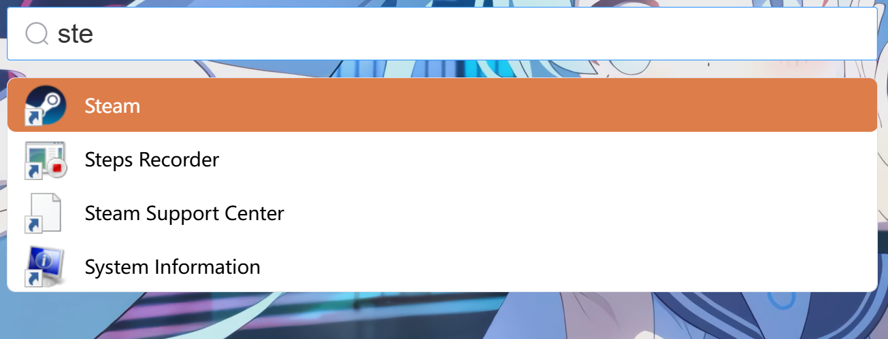
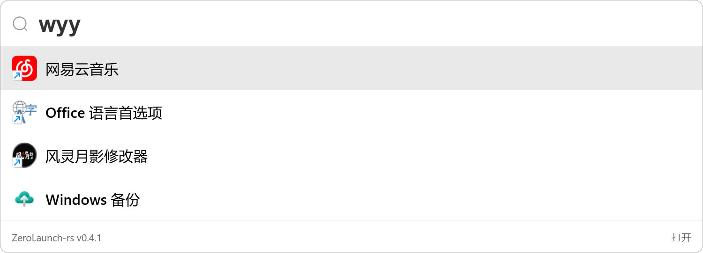
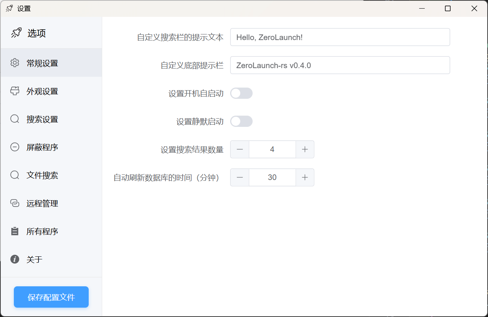
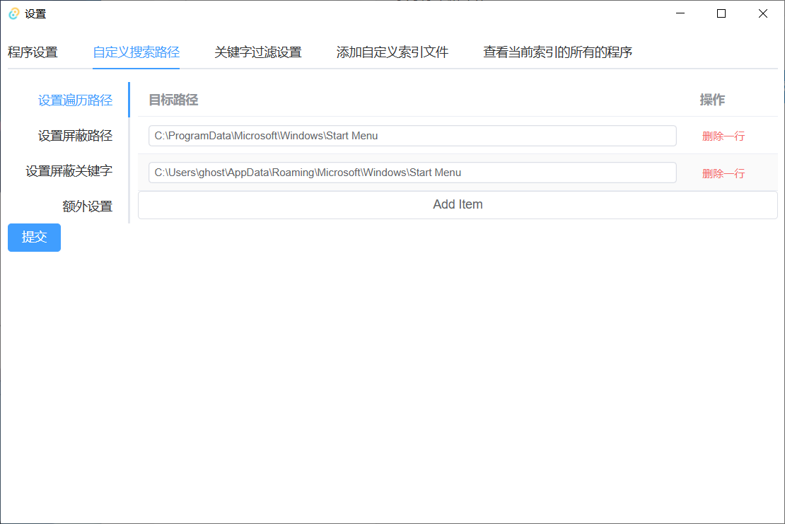
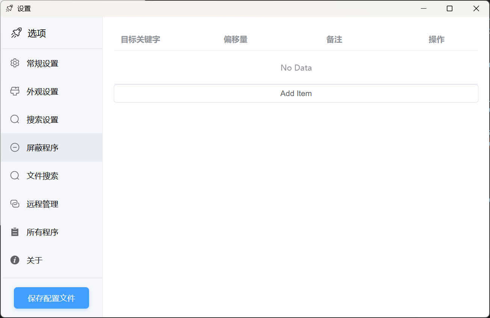
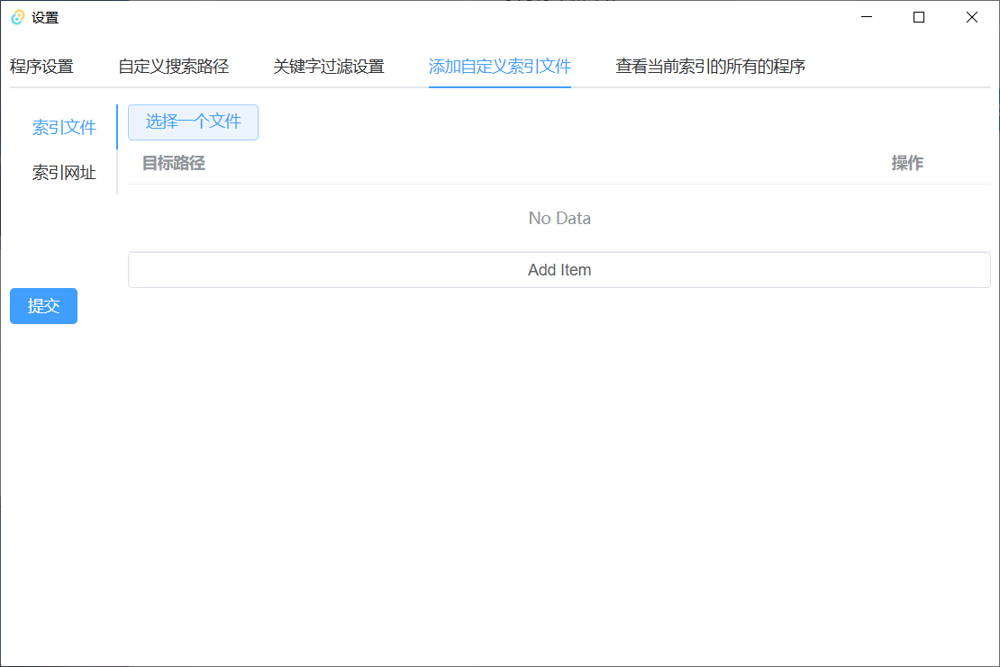
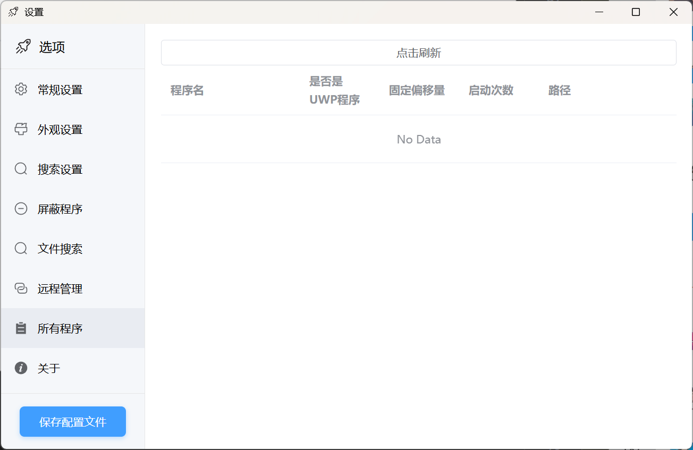

Main Interface

Exact Matching

Fuzzy Matching

Pinyin Matching

**Pinyin Matching also supports fuzzy matching**

For example, when trying to input `wy`, the finger accidentally presses both `y` and `u`, resulting in `wyu`

Settings Interface

Search Paths

Keyword Filtering

Custom Index Files and URLs

Application Statistics

