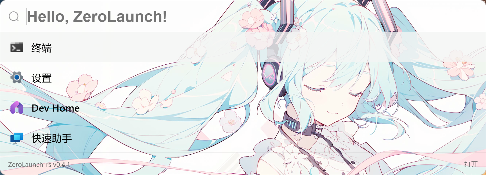
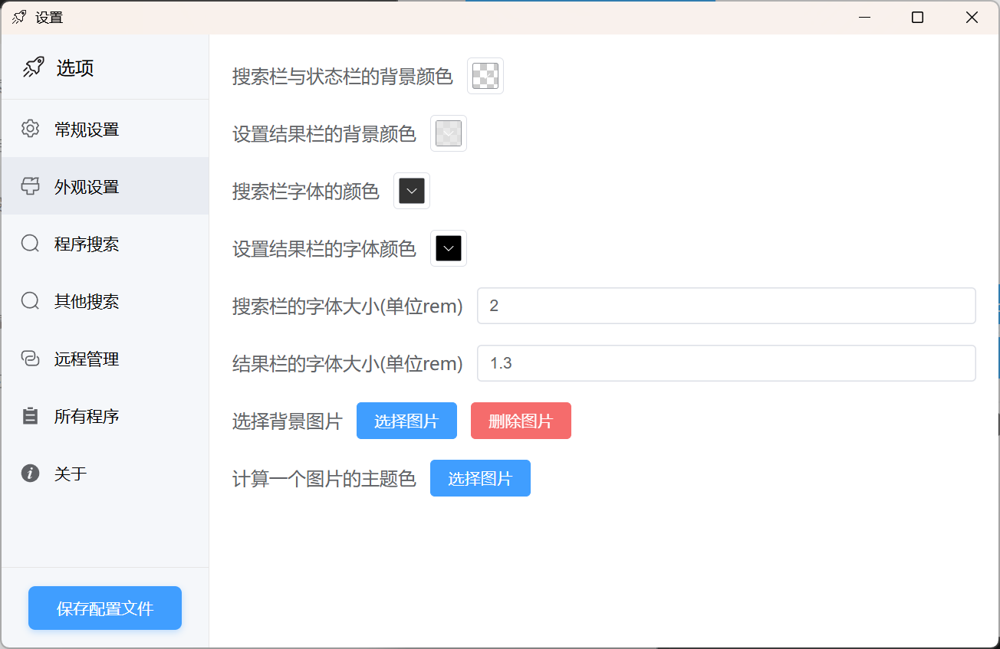
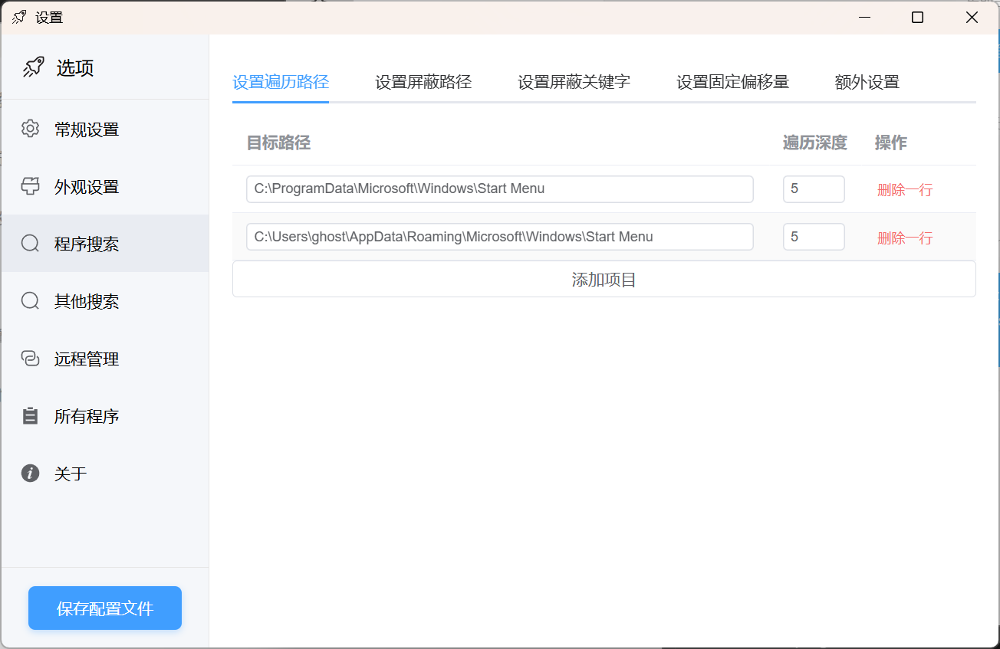
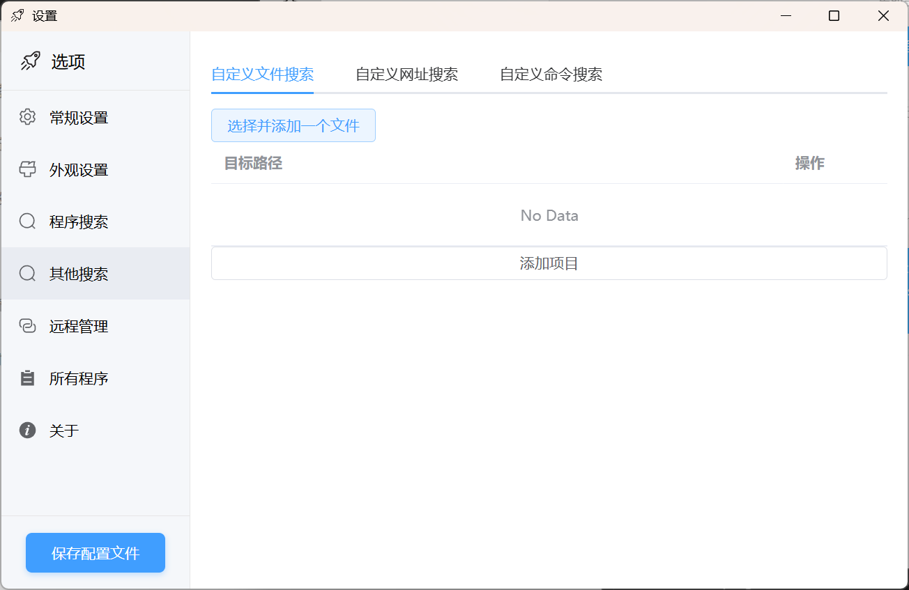
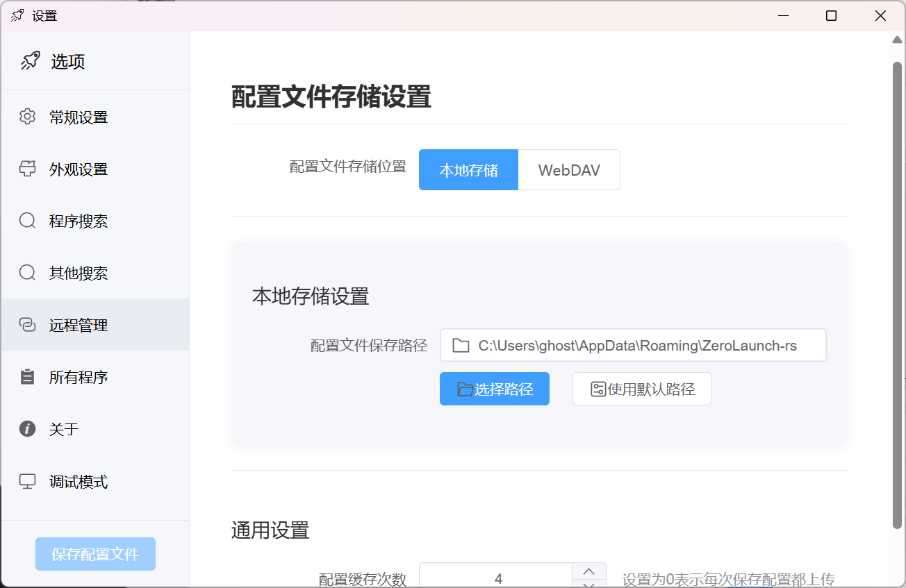
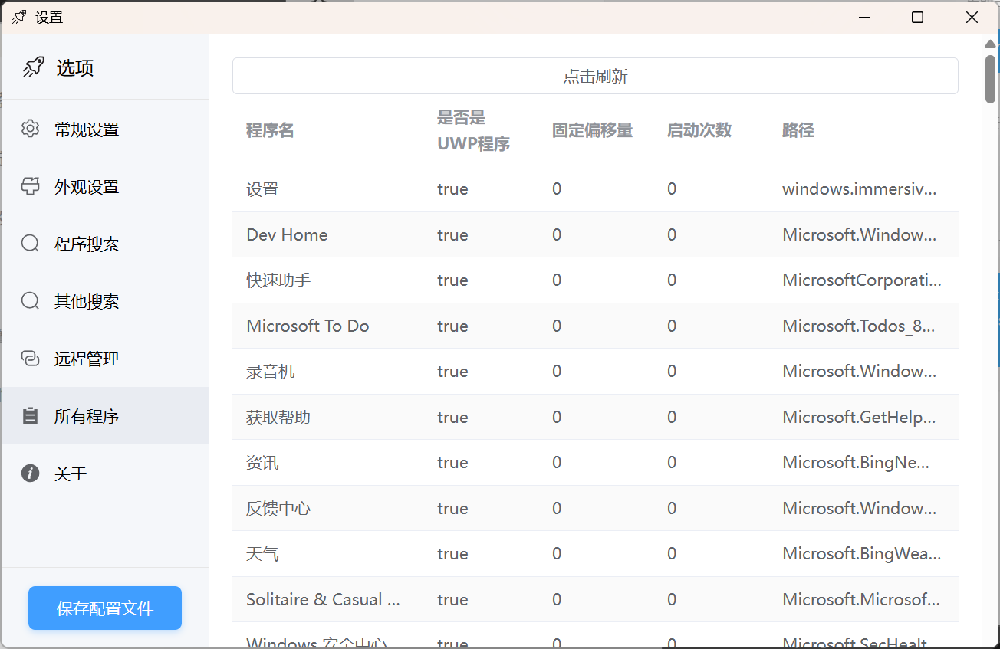
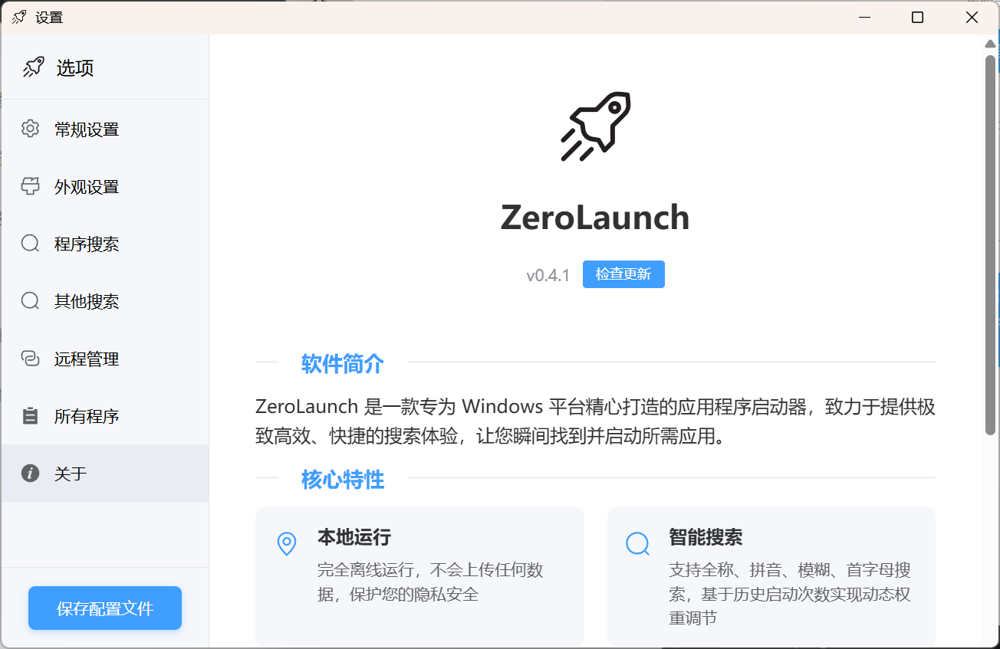
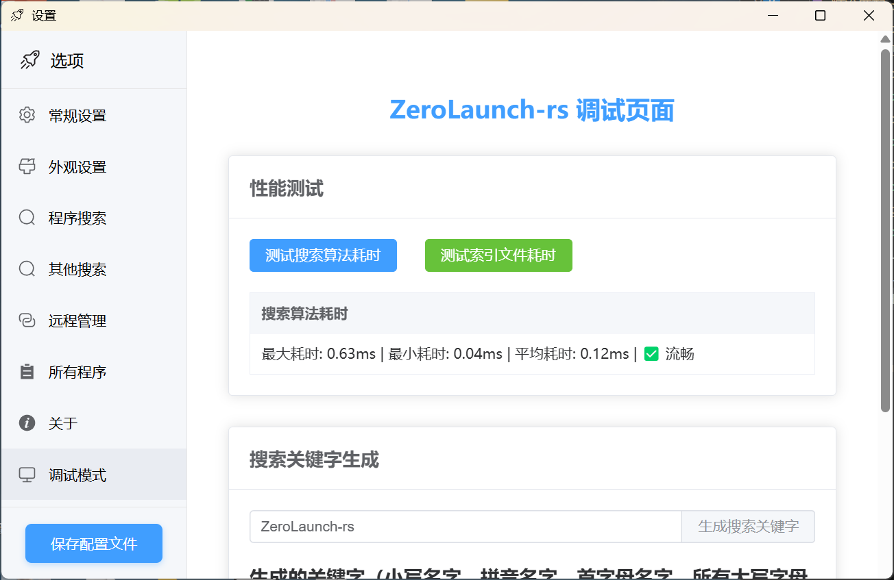

主界面

精准匹配

模糊匹配

拼音匹配

**拼音匹配也支持模糊匹配**

假设要输入`wy`时，手指同时按下了`y`与`u`，打出来了`wyu`的情况

自定义背景

图片来源：[@satori_aiart](https://x.com/satori_aiart/status/1728977252946473051)

设置界面

外观设置

程序搜索

其他搜索（可添加文件，网页，命令搜索）

远程管理（用于更改远程配置文件的保存地址）

所有程序

关于

调试页面（需要手动开启调试模式）

