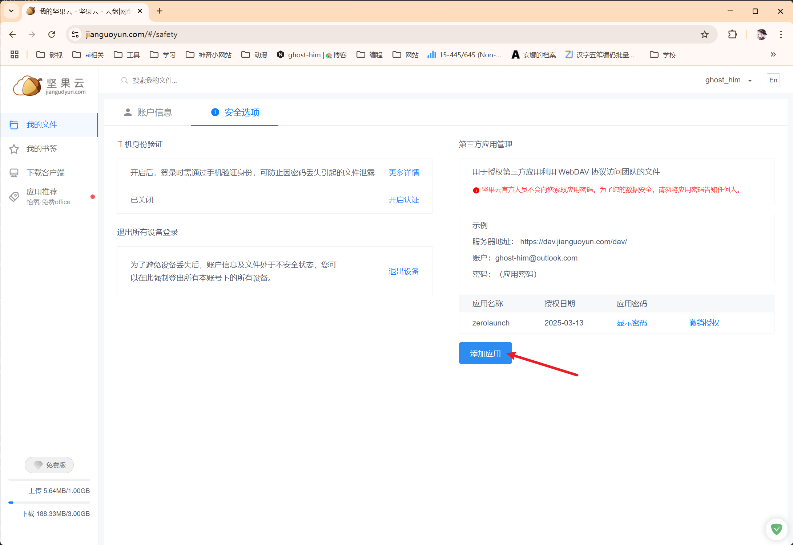

# 常見功能的實現方法

## 有一些不會被使用的程式被添加了

常見的，不會被使用的程式有：
* 各類程式的卸載程式
* 各類程式的說明文件

這些程式已預設添加到屏蔽字中，若有些未被包含的程式也被添加了，可透過以下方式完成程式的屏蔽：
1. 開啟設定介面
2. 點擊「程式搜尋」
3. 點擊「設定屏蔽關鍵字」
4. 點擊「新增項目」
5. 輸入要屏蔽的程式
6. 點擊「儲存設定檔」，程式會自動儲存當前配置並重新載入設定

只要程式中出現關鍵字，則直接屏蔽。因此寫入 `help` 時，可將所有 `xxx help` 程式全部屏蔽

## 更改了安裝路徑的程式沒有被檢測到

程式會遍歷預設安裝路徑下的所有應用。若有自訂安裝路徑未被檢測到，可透過以下方式添加：
1. 開啟設定介面
2. 點擊「程式搜尋」
3. 點擊「設定遍歷路徑」
4. 點擊「新增項目」
5. 將安裝目錄添加並設定對應的遍歷深度
6. 點擊「儲存設定檔」，程式會自動儲存當前配置並重新載入設定

可能問題：[什麼是遍歷深度](#什麼是遍歷深度)

## 添加網址/命令（可自訂開啟Windows設定與各類控制台）

1. 開啟設定介面
2. 點擊「其他搜尋」
3. 點擊對應的標籤頁
4. 完成添加
5. 點擊「儲存設定檔」，程式會自動儲存當前配置並重新載入設定

可能問題：[什麼是關鍵字](#什麼是關鍵字)

添加Windows設定的方法：使用命令：`explorer.exe ms-settings:[目標]`，可在網上查詢`ms-settings`支援的設定。以顯示設定為例：`explorer.exe ms-settings:display`

添加各類控制台：使用` Get-ChildItem -Path C:\Windows\system32\* -Include *.msc | Sort-Object -Property Extension | Select-Object -Property Name | Format-Wide -Column 1`可查看支援的控制台。使用命令：`mmc [目標控制台]`。以本機群組原則編輯器 `gpedit.msc` 為例：使用命令：`mmc gpedit.msc`

## 對搜尋算法的微調怎麼做

首先要對這個搜尋算法的處理流程有一定了解。建議配合程式碼查看，對應的程式碼實現在`src-tauri/src/modules/program_manager/mod.rs`，更新搜尋算法的函式為`update`。

這個搜尋算法的核心思路是：對於使用者的輸入，每一個程式都有一個「匹配值」，而這個匹配值表示使用者預期目標為當前程式的可能性。匹配值越大，則表示使用者的目標程式越有可能是當前的程式。因此結果欄顯示的也是所有程式中匹配值最大的幾個。

一個程式的匹配值由以下幾個部分組成：字串匹配值 + 固定權重 + 動態權重。
* **字串匹配值**：由使用者輸入的字串與搜尋關鍵字計算而來（固定變化）。
* **固定權重**：使用者設定的目標程式的固定權重（由使用者決定）。
* **動態權重**：根據歷史啟動次數計算而來（動態變化）。

而使用者可以更改**固定權重**的數值。注意，固定權重的賦值與**屏蔽關鍵字**一樣。

變更其值的方式如下所示：

1. 開啟設定介面
2. 點擊「程序搜索」
3. 點擊「设置固定偏移量」
4. 點擊「添加项目」
5. 設定對應的值
6. 點擊「保存配置文件」


## 設定檔保存地址的更換

### 更換本機儲存路徑

1. 開啟設定介面
2. 點擊「远程管理」
3. 點擊「本地存储」
4. 點擊「选择路径」按鈕
5. 選擇目標資料夾，成功後設定將自動儲存至新路徑
6. 點擊「测试连接」
7. 點擊「保存配置」

連線測試時會在目標資料夾建立測試檔案，可手動刪除。

### 使用 WebDAV 協議連接雲端硬碟

以堅果雲為操作示範：
1. 開啟設定介面
2. 點擊「远程管理」
3. 點擊「WebDAV」
4. 前往堅果雲官網：`https://www.jianguoyun.com/#/safety`
5. 點擊「添加应用」以取得應用程式密碼



6. 輸入對應資訊
7. 點擊「测试连接」
8. 點擊「保存配置」

# 可能的問題

## 什麼是關鍵字？

關鍵字可理解為搜尋演算法查找對應項的唯一識別碼。

## 什麼是遍歷深度？

用下圖表示：以選擇 `C:\Program Files\` 為例，depth = 5。

```
初始路徑：C:\Program Files\ (深度5層)
├── App1/              ✔️ 索引（第1層）
│   └── Subfolder/     ✔️ 索引（第2層）
│       ├── Config/    ✔️ 索引（第3層）
│       └── Cache/     ✔️ 索引（第3層）
└── App2/
    └── Components/
        └── Plugins/
            └── Legacy/
                └── Layer5/    ✔️ 索引（第5層）
                    └── Layer6 ❌ 忽略（超出深度）
```

## 程式崩潰了

程式的日誌儲存在`C:\Users\[目前使用者名稱]\AppData\Roaming\ZeroLaunch-rs`資料夾下，`logs`下儲存著應用的啟動日誌與崩潰記錄。

## 快捷鍵被佔用了

打開系統托盤，找到 `ZeroLaunch-rs` 的縮略圖，右擊打開二級選單欄，點擊“重新註冊快捷鍵”即可。

**以上內容由 DeepSeek-R1 完成轉換**