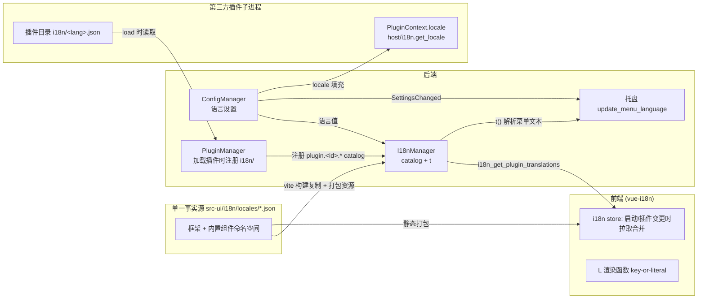

# 翻译系统（i18n）重构设计

> 状态：设计草案（2026-08-09）
> 范围：后端 i18n 基建 + 设置内容（schema 标签）动态翻译 + 托盘本地化 + 第三方插件翻译能力
> 关联：`src-ui/i18n/`、`src-tauri/src/tray/`、`src-tauri/src/core/config/`、`crates/plugin-protocol/`、`crates/plugin-sdk-rust/`

## 1. 背景与问题

当前仅前端（vue-i18n）支持翻译，后端完全没有 i18n 能力，导致三个用户可见的问题：

1. **设置内容不随语言切换**：切换语言后，框架 UI 立即响应，但设置页的字段标签、描述、分组名、组件名、动作按钮文本仍停留在构建期写入的硬编码中文（`SchemaBuilder::text(key, "主题", "...")`）。
2. **系统托盘不随语言切换**：托盘菜单（"设置窗口"等）硬编码中文；`TrayManager::update_menu_language()` 虽已实现重建逻辑，但**无任何调用者**（grep 全仓仅定义处），语言切换时菜单从不重建。
3. **插件无 i18n 能力**：内置插件与第三方插件的 schema 标签、面板动作文本只能写死；第三方插件进程甚至无法得知宿主当前语言，无法本地化查询结果等动态内容。

另有基础设施线索：vite 构建时已把 `src-ui/i18n/locales/*.json` 复制到 `src-tauri/locales/`，且 `tauri.conf.json` 的 `bundle.resources` 已包含 `"locales/"` —— **后端在运行时本就持有语言包，但无人消费**。

## 2. 现状架构（已验证事实）

| 层 | 现状 |
|---|---|
| 前端翻译 | vue-i18n（`legacy: false`），3 份 JSON：`src-ui/i18n/locales/{zh-Hans,zh-Hant,en}.json`；命名空间 `appearance/common/settings/.../translator`；`setLocale()` 响应式切换，`fallbackLocale: 'en'` |
| 语言设置 | 持久化于 `appearance-config.language`（后端 `AppearanceSettings`），合法值 `zh-Hans/zh-Hant/en` |
| 切换传播 | `config_apply_settings` → `ConfigManager` → `ConfigEvent::SettingsChanged` → bootstrap 订阅循环（`bootstrap.rs:337`）桥接 `config-changed` 事件 → 前端 `onConfigChanged` → `applyRemoteSettings` → `setLocale()` |
| schema 标签 | `SchemaBuilder::text(key, label, desc)` 构建期写入 `FieldUiMetadata.label/description/group`；`options_with_labels` 写 `enum_labels`；组件名/描述写 `ComponentCore`；动作文本写 `ConfigActionDef.label/description`；全部硬编码中文 |
| schema 下发 | `config_get_schema` IPC → 前端 `ComponentConfigLoader` → `DynamicForm` 直接插值渲染；`config-store.ts` 按 componentId **缓存 schema** |
| 托盘 | 菜单项 + tooltip 硬编码；`update_menu_language()` 无调用者 |
| 第三方插件 | 独立子进程，JSON-RPC over stdio；schema 经 `plugin/get_settings_schema` 上报（标签同样硬编码）；`PluginContext` 跨 RPC 序列化（含 `query_channel`）；`HostProxy` 提供 `host/*` 反向调用；UI 资产经 `zlplugin://<id>/ui/<path>` 只读放行 |
| 后端资源 | `bootstrap.rs:110` 已用 `app.path().resource_dir()` 解析资源目录；`locales/` 已打包 |

## 3. 设计目标与决策

**目标**
1. 语言切换后：设置内容、托盘、插件输出全部即时响应（不重启、不重拉）。
2. 内置插件与第三方插件获得同等的翻译能力，且**第三方不强制迁移**（字面量 fallback 永远可用）。
3. 单一事实源：手写语言包只有 `src-ui/i18n/locales/` 一份，后端复用 vite 复制产物。

**核心决策 D1 — key-or-literal（前端翻译）而非后端翻译**
Schema 的 `label/description/group/enum_labels`、组件名/描述、动作标签一律放宽为 **「i18n key 或字面量」**：前端渲染统一走 `L(s)` 帮助函数 —— `i18n.global.te(s) ? t(s) : s`。理由：

- 语言切换零重拉：vue-i18n 响应式重渲染，不依赖 `config_get_schema` 重取（`config-store` 的按 componentId 缓存无需失效）；
- IPC 契约稳定：schema 响应与全局语言状态无关，仍是纯数据；
- 渐进迁移：未迁移的字段 label 是中文原文，`te()` 解析不到 key 时原样显示 —— 行为与今天完全一致；
- 第三方兼容：未提供翻译的插件照常显示字面量。

否决的备选（后端按当前语言解析 label 后下发）：语言切换后必须全量失效 schema 缓存并重拉，`config_get_schema` 响应随全局状态漂移，契约不稳定，且后端要为每个字符串做解析 —— 变更面反而更大。

**核心决策 D2 — 插件翻译资源随插件目录分发**
第三方插件在插件目录内提供 `i18n/<lang>.json`（如 `i18n/zh-Hans.json`），宿主在插件加载时读取、校验、以 `plugin.<pluginId>.` 前缀注册进后端 catalog；前端经新 IPC 拉取合并。不引入 RPC 握手新消息、不要求改 manifest。

**核心决策 D3 — 插件进程通过 PluginContext.locale + host RPC 获取当前语言**
- `PluginContext` 增加 `locale` 字段（`#[serde(default)]` 保证旧插件兼容），宿主在查询/动作分发时填充 —— 覆盖绝大多数"按语言生成本地化文本"场景（面板标题、错误提示、结果项）；
- `host/i18n.get_locale` RPC（`HostProxy::get_locale()`）—— 插件任意时刻可主动查询。

## 4. 总体架构



## 5. 统一 catalog 与 key 语义

### 5.1 key 命名空间

| 来源 | 命名空间 | 说明 |
|---|---|---|
| 框架/内置组件 | `settings.*`、`components.<componentId>.*` 等 | 手写于 `src-ui/i18n/locales/`，前端静态打包；后端经 vite 复制产物读取同一份 |
| 第三方插件 | `plugin.<pluginId>.<key>` | 插件文件内写裸 key，宿主注册时统一加前缀（防跨插件 key 碰撞） |

### 5.2 内置组件 key 规则（迁移约定）

- 组件名/描述：`components.<id>.name` / `components.<id>.description`
- 字段标签/描述：`components.<id>.fields.<fieldKey>.label` / `.desc`
- 分组名：`components.<id>.groups.<groupSlug>`（现有 `group("theme")` 等已是 ASCII slug，直接复用值）
- 下拉选项标签：`components.<id>.fields.<fieldKey>.options.<value>`
- 配置动作：`components.<id>.actions.<actionId>.label` / `.description`

### 5.3 豁免清单（禁止 key 化，保持字面量）

- **持久化枚举值**：`options()` 的值、settings JSON 中存储的字符串（如 `llm_vendor` 的存储值）；仅 `enum_labels` 可 key 化
- **语言选择器选项**：语言名固定显示各语言自身名称（"简体中文/繁體中文/English"），不随界面语言翻译（既有惯例，`zerolaunch-add-i18n-language` 已验证）
- **翻译插件的语言码 → 语言名映射**（`language_display_name`）：语言码是查询语法/数据，不是 UI 文案
- **用户可编辑的文本数据**：如 `search_bar_placeholder`（搜索栏占位符）—— 这是设置值不是 UI 文案
- **日志字符串**：`console.warn` / `tracing` 输出可保留硬编码
- **插件内部查询语法示例**：如 `fy @en 你好` 中的语言词

## 6. 后端 I18nManager（新模块 `src-tauri/src/core/i18n/`）

### 6.1 职责与 API

```rust
pub struct I18nManager { /* 内置 catalog: HashMap<lang, Map<String,String>>；插件 catalog: RwLock<HashMap<plugin_id, HashMap<lang, Map<String,String>>>> */ }

impl I18nManager {
    /// 启动时加载 resource_dir/locales/<lang>.json（zh-Hans/zh-Hant/en 三份）
    pub fn load(resource_dir: PathBuf) -> Arc<Self>;
    /// 当前语言（读 ConfigManager → appearance-config.language，兜底 get_default_app_language）
    pub fn current_language(&self, cm: &ConfigManager) -> String;
    /// 后端 t()：当前语言 → en → 原样返回 key
    pub fn t(&self, lang: &str, key: &str) -> String;
    /// 插件 load 时注册；unload 时移除
    pub fn register_plugin_catalog(&self, plugin_id: &str, dir: &Path);
    pub fn unregister_plugin_catalog(&self, plugin_id: &str);
    /// 合并某语言下所有插件 catalog（带 plugin.<id>. 前缀），供 IPC 下发
    pub fn plugin_catalog_for(&self, lang: &str) -> BTreeMap<String, String>;
}
```

### 6.2 加载与校验

- 内置 catalog：读取 `resource_dir/locales/<lang>.json`（vite 构建时复制、已打包进资源）。**后端只读，不写**；单文件缺失/损坏时 `warn!` 并回退空 catalog（`t()` 返回 key），不影响启动。
- 插件 catalog：扫描 `<plugin_dir>/i18n/*.json`，文件名（去 `.json`）即语言码。校验：文件 ≤ 64 KiB、JSON 为扁平或嵌套对象（展平为 `.` 连接 key）、所有叶子值为 string；违规文件跳过并 `warn!`。注册时展平并加 `plugin.<id>.` 前缀。
- 语言码不在宿主支持列表（`zh-Hans/zh-Hant/en`）的文件：跳过并 `warn!`（防止脏数据进 catalog）。

### 6.3 归属与接线

- `AppState` 增加 `i18n_manager` 字段（模式同 `config_manager`）；bootstrap 在资源目录解析后创建。
- 插件 catalog 注册点：`PluginManager` load 插件（`manager.rs` 生命周期）成功后就地调用 `register_plugin_catalog`；unload 时移除 —— 插件目录生命周期由 PluginManager 单一持有，I18nManager 不自行扫盘。

## 7. IPC 与前端消费

### 7.1 新 IPC：`i18n_get_plugin_translations(lang)`

- 位置：`commands/i18n.rs`（薄代理，读 `AppState.i18n_manager`）。
- 返回：`Record<string, string>`（扁平 key→value，key 已含 `plugin.<id>.` 前缀）。
- 参数 `lang` 由前端传入当前 locale（后端也可兜底读配置，但显式传参保持纯函数语义）。

### 7.2 前端

- **渲染帮助函数**（`src-ui/i18n/index.ts` 导出）：

```ts
/** key-or-literal：命中 catalog 翻译，否则原样显示（兼容字面量/未迁移字段） */
export function resolveText(s: string): string {
  return i18n.global.te(s) ? i18n.global.t(s) : s
}
```

- **catalog 合并 store**（新 `src-ui/stores/i18n-store.ts`）：`loadPluginTranslations(lang)` 调 IPC，用 **`setLocaleMessage` 全量重建**（`{ ...frameworkBase, ...pluginCatalog }`）而非 `mergeLocaleMessage` —— 后者跨调用累积，插件卸载后残留旧 key。
  - 调用时机：主窗口与设置窗口启动时各一次；`PluginsManagement.vue` 完成安装/卸载/重载后一次。
- **渲染点替换**（`{{ field.label }}` → `{{ L(field.label) }}`，逐处审计）：

| 文件 | 字段 |
|---|---|
| `DynamicFormField.vue` | `field.label`、`field.description` |
| `DynamicForm.vue` | `schema.componentName`（标题） |
| `FormSection.vue` | `group.name`（分组标题） |
| `SelectField.vue` | `enumLabels`（选项文案） |
| `ConfigActionButton.vue` | `actionDef.label`（按钮）、成功/失败 toast 中的 label |
| 数组子组件（`ObjectTableArray` 等） | 列头 `labelFieldLabel`、字段 label |
| 设置侧栏（`settingsSidebar.ts`/列表面板） | `componentName`、`componentDescription` |
| `PluginsManagement.vue` | manifest `name`、`description` |
| 结果项动作按钮 | `ResultAction.label`（key-or-literal） |

- **选项数组必须是 computed**：凡 `t()`/`L()` 参与生成选项的数组（含 `enum_labels` 映射）须用 `computed` 包裹，否则切换语言后选项文案不刷新（既有教训，`zero-launch-plugin-i18n-migration`）。

## 8. 语言变更传播链（目标终态）

```
用户在设置页切换语言
→ config_apply_settings("appearance-config", { language })
→ ConfigManager → ConfigEvent::SettingsChanged
   ├─→ bootstrap 事件循环（bootstrap.rs:337）
   │     ├─→ 前端 config-changed 事件 → applyRemoteSettings → setLocale()   [已有]
   │     └─→ TrayManager::update_menu_language()                            [新增接线]
   │           └─ 菜单文本改由 I18nManager::t() 解析（"设置窗口" → settings.tray.showSettings 等）
   │             tooltip 保持品牌名 "zerolaunch-rs"（非 UI 文案）
   └─→ （后续可选）宿主 → 各插件进程 locale_changed 通知
```

要点：
- 前端 **不重拉 schema**（D1 的直接收益）；设置页所有文本经 `L()`/`t()` 响应式刷新。
- 托盘重建复用现有 `update_menu_language()`（已含保留游戏模式勾选状态逻辑），只需把 `build_tray_menu` 与游戏模式菜单项的文本改为查表。
- 菜单 key：`tray.showSettings` / `tray.refreshDatabase` / `tray.reregisterHotkeys` / `tray.gameMode` / `tray.exitProgram`，加入三份语言包。

## 9. 内置组件迁移规则

### 9.1 迁移方式

机械替换 + 补键，**不改变 schema 生成逻辑的形态**：

```rust
// 迁移前
SchemaBuilder::text("theme", "主题", "选择浅色、深色或跟随系统主题").group("theme")
// 迁移后（label/desc 变 key，其余不变）
SchemaBuilder::text("theme",
    "components.appearance-config.fields.theme.label",
    "components.appearance-config.fields.theme.desc").group("theme")
```

- 同一 commit 内：改调用点 + 三份语言包补键（键结构三语必须对齐）。
- 组件名/描述（`ComponentCore::new`）、`ConfigActionDef`、`options_with_labels` 标签同规则。
- 迁移前对每个 `component_name`/`description` 做 grep 消费点审计，确认无持久化/匹配逻辑依赖字面量。

### 9.2 迁移顺序（按可见性排序）

1. `appearance-config`（语言切换入口所在组件，用户最先感知）
2. `general-config`、`storage-config`、`hotkey-config` 等核心配置组件
3. 数据源/执行器/搜索引擎等业务组件
4. 触发类插件（calculator/translator 的 schema 与面板动作 label）

未迁移部分保持字面量回退，**功能与现状完全等价**，迁移可分批落地。

## 10. 第三方插件支持

### 10.1 分发翻译资源（宿主侧）

```
<plugins_dir>/<plugin-id>/
├── manifest.toml
├── bin/…                 # 插件可执行文件
├── ui/…                  # 自定义设置页资产（zlplugin:// 已有）
└── i18n/
    ├── zh-Hans.json      # {"settings.label": "…", …}   ← 裸 key，宿主加前缀
    └── en.json
```

- 插件加载成功后由 PluginManager 注册进 I18nManager（§6.3）；前端在 `PluginsManagement` 操作后重拉合并（§7.2）。
- 插件自身也可经 `zlplugin://<id>/i18n/<lang>.json` 读取自己的语言包（自定义设置页场景；`zlplugin_protocol.rs` 需把路径白名单从 `ui/` 扩为 `ui/|i18n/`—— 后续项，可选）。

### 10.2 插件进程获取语言（D3）

- `PluginContext` 增加：

```rust
/// 宿主当前界面语言（如 "zh-Hans"）；旧插件反序列化缺省为空串。
#[serde(default)]
pub locale: String,
```

  宿主填充点：`session_dispatcher` 构造 PluginContext 处 + `cli_server` 查询处（共用 `current_locale()` 工具）。
- `plugin-protocol` 新增 `host/i18n.get_locale` 方法；`plugin-sdk-rust` `HostProxy` 增加：

```rust
pub async fn get_locale(&self) -> Result<String, String> { … }
```

- 插件查询时按 `ctx.locale`（或 `host.get_locale()`）生成本地化面板文本/结果项。
- SDK 提供 key 帮助（可选）：`pub fn t_key(&self, key: &str) -> String` → `format!("plugin.{}.{}", plugin_id, key)`，供插件在 schema label / `ResultAction.label` 中使用 key-or-literal 约定。

### 10.3 兼容性

- 未提供 `i18n/` 目录、label 用字面量的旧插件：`te()` 不命中 → 原样显示，与现状等价。
- `PluginContext` 加字段带 `#[serde(default)]`：宿主→旧插件（新字段被忽略）与旧插件→宿主（缺省）双向兼容。

## 11. 迁移步骤

| Phase | 内容 | 验收 |
|---|---|---|
| P1 后端基建 | `core/i18n/` I18nManager + AppState 接线 + `commands/i18n.rs` IPC + 托盘文本查表 + bootstrap 事件循环接 `update_menu_language()` | `cargo check` 零错误；托盘菜单随语言切换 |
| P2 前端基建 | `resolveText` + i18n-store + 渲染点替换（§7.2 清单）+ 启动/插件页合并时机 | `bunx vue-tsc` 通过；语言切换后设置页/插件页即时刷新；三语键对齐校验脚本通过 |
| P3 插件协议 | `PluginContext.locale` + `host/i18n.get_locale` + SDK `HostProxy::get_locale()`/`t_key()` | 插件模板示例插件按语言输出面板文本（CDP/集成测试验证） |
| P4 内置迁移 | §9 顺序迁移内置组件 label → key + 三语补键 | 语言切换后全部设置内容刷新；无残留中文硬编码（grep 抽查） |
| P5 第三方约定 | 文档（`crates/plugin-api/README.md`/插件模板）补 i18n 章节；`zlplugin://` 可选扩 `i18n/` 路径 | 示例第三方插件带 `i18n/` 目录可安装并翻译其设置项 |

## 12. 验证方案

1. **三语键对齐**：`node -e` 递归比对 `zh-Hans/en/zh-Hant` 键集合（既有流程，`zerolaunch-add-i18n-language`）。
2. **前端构建**：`bunx vue-tsc --noEmit` + `bun run build`。
3. **后端构建**：`cargo check --workspace`。
4. **运行时验证（CDP 附加真实窗口）**：
   - 设置页切换语言 → 断言当前组件 schema 标签、分组、组件名、动作按钮文本即时变化（无需重开组件）；
   - 断言插件管理页 manifest 名称/描述变化；
   - 检查托盘菜单项文本变化（Windows 原生菜单，截图/枚举校验）。
5. **插件链路**：装载带 `i18n/` 的 fixture 插件 → 断言 `config_get_schema` 返回 key、前端渲染翻译文本、`i18n_get_plugin_translations` 返回带前缀 catalog；插件侧 `ctx.locale` 生效。

## 13. 风险与边界

- **te() 误判**：若某个字面量恰好与某 catalog key 同名（极低概率），会被误翻译 —— 可接受；文档注明 key 空间保留。
- **mergeLocaleMessage 累积**：已规避（§7.2 全量重建）。
- **资源路径**：`resource_dir/locales/` 在 dev（vite dev 复制）与打包（bundle resources）两种模式均可用；`cargo test` 单测环境无该目录时 `t()` 返回 key，测试不断言文案。
- **组件名 key 化的连带**：迁移前必须审计 `component_name` 的消费点（日志、配置持久化、前端匹配逻辑），仅 UI 展示点可 key 化。
- **不纳入范围**（后续项）：CLI 服务器错误消息本地化、宿主 → 插件 `locale_changed` 推送通知、插件自定义设置页内嵌 i18n 加载、托盘 tooltip 本地化（品牌名）。
