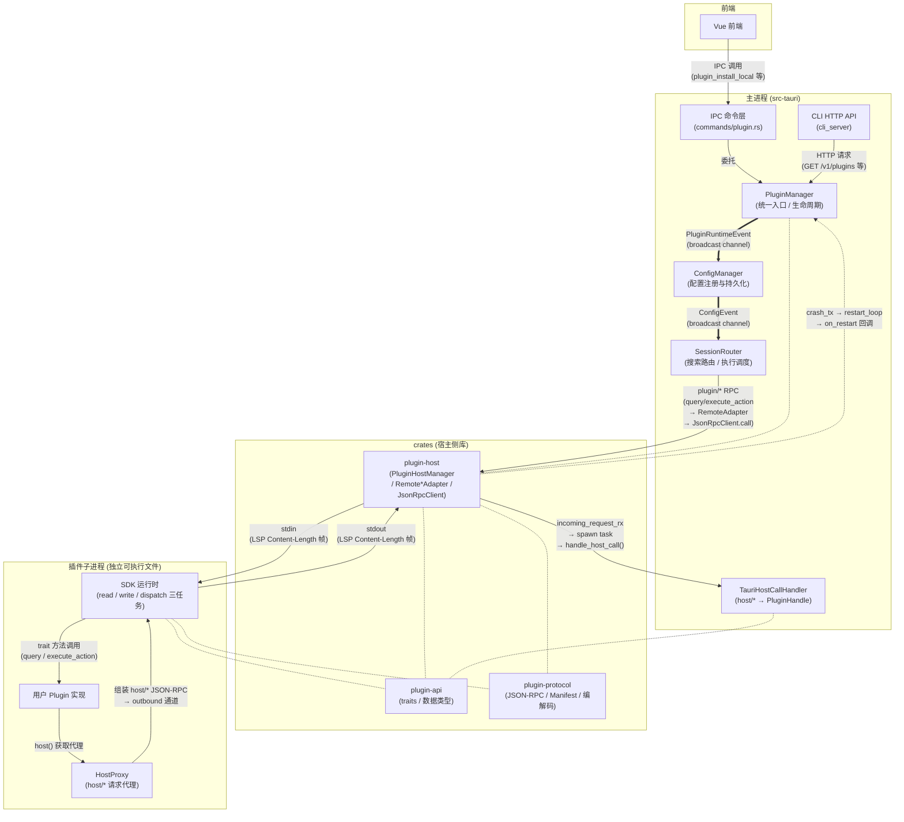

# ZeroLaunch 第三方插件系统深度分析

> 本文从代码实现角度，系统性地分析第三方插件的架构、通信、生命周期、管理器交互、前后端通信等全部环节。

---

## 目录

1. [架构总览](#1-架构总览)
2. [进程模型](#2-进程模型)
3. [通信协议](#3-通信协议)
4. [方法命名空间](#4-方法命名空间)
5. [插件生命周期](#5-插件生命周期)
6. [插件管理器](#6-插件管理器)
7. [管理器间交互（事件驱动）](#7-管理器间交互事件驱动)
8. [适配器模式](#8-适配器模式)
9. [前端交互](#9-前端交互)
10. [CLI 交互](#10-cli-交互)
11. [Manifest 结构](#11-manifest-结构)
12. [zlplugin:// 协议](#12-zlplugin-协议)
13. [内置插件 vs 第三方插件](#13-内置插件-vs-第三方插件)
14. [SDK 与插件开发](#14-sdk-与插件开发)
15. [PluginHandle 权限模型](#15-pluginhandle-权限模型)
16. [关键结论](#16-关键结论)

---

## 1. 架构总览



### 图例

| 线型 | 语义 | 示例 |
|---|---|---|
| `-->` 实线箭头 | **运行时数据流**：IPC 调用、RPC 请求/响应、函数调用 | `FE --> IPC`、`SR --> HOST` |
| `==>` 粗线箭头 | **广播事件**：一对多解耦（tokio broadcast channel） | `PM ==> CM`、`CM ==> SR` |
| `-. text .->` 点线箭头 | **异步通道**：mpsc channel 通知 | `HOST .-> PM` |
| `-.-` 无箭头虚线 | **编译期依赖**：crate 引用 / import | `SDK -.- API` |

### 分层组件

| 层 | crate/目录 | 职责 |
|---|---|---|
| **API 契约** | `crates/plugin-api/` | `Plugin` / `DataSource` / `ActionExecutor` trait、`PluginHandle`、`PluginMetadata`、配置类型 |
| **协议** | `crates/plugin-protocol/` | JSON-RPC 2.0 消息信封 + 方法名常量 + Manifest 结构 + LSP 帧编解码 |
| **子进程管理** | `crates/plugin-host/` | `PluginHostManager`（顶层管理器）、`PluginProcess`（单个子进程）、`JsonRpcClient`、`StdioTransport`、`Remote*Adapter` 适配器 |
| **主程序集成** | `src-tauri/src/plugin_framework/` | `PluginManager`（统一入口）、`TauriHostCallHandler`、`PluginInstaller`、`ZlpluginProtocolHandler` |
| **SDK** | `crates/plugin-sdk-rust/` | `run()` 启动函数、`HostProxy` 代理、三任务异步运行时 |

### 依赖方向

```
plugin-api ← plugin-protocol ← plugin-host ← src-tauri
plugin-api ← plugin-sdk-rust
```

禁止反向依赖。

---

## 2. 进程模型

第三方插件运行在 **独立子进程** 中（非主进程内）。

- 每个插件拥有 **独立 PID 和地址空间**
- 启动方式：读取 `manifest.toml` 中 `runtime.command`（相对路径，相对于插件目录），通过 `StdioTransport::spawn()` 创建子进程
- 子进程启动时接收三个环境变量：

| 环境变量 | 说明 |
|---|---|
| `ZEROLAUNCH_PLUGIN_ID` | 插件 ID |
| `ZEROLAUNCH_DATA_DIR` | 数据目录 `<app_data>/plugin-data/<plugin-id>/` |
| `ZEROLAUNCH_LOG_DIR` | 日志目录 `<app_data>/plugin-logs/` |

- 子进程的 stderr 被重定向到日志文件（`<log-dir>/<plugin-id>.log`），单文件上限 10MB

### 进程状态机

```
Starting → Running → Crashed { restarts, last_error } → (重新拉起)
                    → Stopped (优雅关闭)
                    → Error(String) (启动失败)
```

---

## 3. 通信协议

**JSON-RPC 2.0 over LSP Content-Length 帧，通过 stdin/stdout 管道。**

### 帧格式

```
Content-Length: 123\r\n
\r\n
{"jsonrpc":"2.0","id":1,"method":"plugin/query","params":{…}}
```

### 消息信封

```rust
pub enum Message {
    Request(Request),     // 有 id，期待响应
    Response(Response),   // 有 id，请求的应答
    Notification(Notification), // 无 id，fire-and-forget
}
```

- **Request**: `{ jsonrpc, id, method, params }` — 主程序→插件
- **Response**: `{ jsonrpc, id, result?, error? }` — 插件→主程序
- **Notification**: `{ jsonrpc, method, params }` — 如 `plugin/ready`、`plugin/crashed`

### 帧限制

| 限制 | 值 |
|---|---|
| 最大帧大小 | 16 MB (`MAX_FRAME_SIZE`) |
| 最大头部大小 | 512 字节 (`MAX_HEADER_SIZE`) |

### 通信架构（插件 SDK 侧）

SDK 运行时采用 **三任务异步架构**：

```
- read_task:   唯一 stdin 读取者，解析 LSP 帧，路由响应到 pending_map，
              转发请求到 dispatch_task
- write_task:  唯一 stdout 写入者，将所有出站消息编码为 LSP 帧
- dispatch_task: 处理 plugin/* 请求，调用用户 Plugin trait 实现，
              将响应发到 write_task
```

HostProxy 通过共享的 `pending_map`（`DashMap<u64, oneshot::Sender>`）和 `outbound_tx`（`mpsc::Sender<Vec<u8>>`）发送 `host/*` 请求，**避免了同步 BufReader 造成的死锁问题**。

---

## 4. 方法命名空间

### 插件侧（主程序 → 插件）`plugin/*`

| 命名空间 | 说明 | 对应 Plugin trait 方法 |
|---|---|---|
| `plugin/initialize` | 初始化握手 | `init()` |
| `plugin/shutdown` | 优雅关闭 | — |
| `plugin/get_metadata` | 获取元数据 | `metadata()` |
| `plugin/get_components` | 获取组件列表 | — (SDK 自动发现) |
| `plugin/get_settings_schema` | 获取设置 schema | `Configurable::setting_schema()` |
| `plugin/get_settings` | 获取设置值 | `Configurable::get_settings()` |
| `plugin/apply_settings` | 应用设置 | `Configurable::apply_settings()` |
| `plugin/validate_settings` | 验证设置 | `Configurable::validate_settings()` |
| `plugin/config_actions` | 获取配置动作 | `Configurable::config_actions()` |
| `plugin/execute_config_action` | 执行配置动作 | `Configurable::execute_config_action()` |
| `plugin/query` | 搜索查询 | `Plugin::query()` |
| `plugin/execute_action` | 执行动作 | `Plugin::execute_action()` |
| `plugin/fetch_candidates` | 获取候选项 | `DataSource::fetch_candidates()` |
| `plugin/supported_target_types` | 支持的 TargetType | `ActionExecutor::supported_target_types()` |
| `plugin/supported_actions` | 支持的动作 | `ActionExecutor::supported_actions()` |
| `plugin/executor_execute` | 执行器执行 | `ActionExecutor::execute()` |

### 宿主侧（插件 → 主程序）`host/*`

| 命名空间 | 平台能力 | 对应 PluginHandle 方法 |
|---|---|---|
| `host/log` | 写日志 | `log()` |
| `host/notify` | 桌面通知 | `notify()` |
| `host/shell.open` | 打开文件/URL | `shell().open()` |
| `host/shell.open_folder` | 打开文件夹 | `shell().open_folder()` |
| `host/shell.execute_elevation` | 提权执行 | `shell().execute_elevation()` |
| `host/shell.execute_command` | 执行命令 | `shell().execute_command()` |
| `host/window.activate_by_process` | 激活窗口 | `window().activate_by_process()` |
| `host/icon.get` | 获取图标 | `icon().get()` |
| `host/app.enumerate` | 枚举系统应用 | `app().enumerate()` |
| `host/path.resolve` | 解析系统路径 | `path().resolve()` |
| `host/resource.upload` | 上传资源 | `resource().upload()` |
| `host/resource.put` | 写入资源 | `resource().put()` |
| `host/resource.get` | 读取资源 | `resource().get()` |
| `host/resource.delete` | 删除资源 | `resource().delete()` |
| `host/resource.list` | 列出资源 | `resource().list()` |
| `host/parameter.resolve` | 解析参数 | `parameter().resolve()` |

### 通知方法

| 方法 | 方向 | 说明 |
|---|---|---|
| `plugin/ready` | 插件→主程序 | 通知已就绪 |
| `plugin/crashed` | 插件→主程序 | 通知已崩溃 |

---

## 5. 插件生命周期

### 启动流程

```
1. PluginManager::load_all_third_party()
   └─ scan_plugins_dir() — 扫描 <app_data>/plugins/ 下含 manifest.toml 的子目录
   └─ 对每个目录调用 load_single_plugin()
       ├─ 读 manifest.toml → Manifest
       ├─ host_api.register(&plugin_id, config) — 注册 PluginHandle
       ├─ 创建 TauriHostCallHandler (host/* 分发器)
       ├─ PluginHostManager::load()
       │   ├─ PluginProcess::spawn()
       │   │   ├─ 解析 manifest.runtime.command → 子进程路径
       │   │   ├─ StdioTransport::spawn() — 创建子进程 + 三根管道
       │   │   ├─ 建立 JsonRpcClient — 后台读写循环
       │   │   ├─ 发送 plugin/initialize JSON-RPC 请求
       │   │   ├─ 启动 watchdog 监控进程退出
       │   │   └─ 返回 PluginProcess
       │   ├─ discover_components()
       │   │   ├─ plugin/get_metadata
       │   │   ├─ plugin/get_components
       │   │   └─ 对每个组件：get_settings_schema / get_settings / config_actions
       │   │   └─ 对 ActionExecutor：supported_target_types + supported_actions
       │   ├─ build_adapters() — 构建 Remote*Adapter 适配器
       │   ├─ 存入 self.plugins (DashMap)
       │   └─ 返回 PluginRegistration
       ├─ 发送 PluginRuntimeEvent::PluginLoaded 广播
       ├─ 缓存 adapters 供崩溃恢复
       └─ 发送 Tauri 前端事件 "plugin-installed"
```

### 卸载流程

```
PluginManager::uninstall(plugin_id)
  ├─ 发送 PluginRuntimeEvent::PluginUnloaded → CM 解注册
  ├─ forget_adapters(plugin_id) — 清除缓存
  ├─ remove_third_party_info(plugin_id) — 移除信息
  ├─ PluginHostManager::unload()
  │   ├─ PluginProcess::shutdown()
  │   │   ├─ 标记 ProcessState::Stopped（防 watchdog 误重启）
  │   │   ├─ 发送 plugin/shutdown JSON-RPC
  │   │   └─ 超时或错误 → force_kill_process(PID)
  │   └─ 清理注册表、日志文件
  ├─ host_api.unregister(plugin_id)
  ├─ 删除插件目录
  └─ 发送 Tauri 事件 "plugin-uninstalled"
```

### 崩溃恢复流程

```
watchdog 检测到进程退出（非 Stopped 状态）
  ├─ 设置 ProcessState::Crashed
  └─ 发送 plugin_id 到 crash_tx

restart_loop 收到崩溃通知
  ├─ 检查重启次数 ≤ manifest.runtime.max_restart（默认 3）
  │   └─ 超过上限 → 停用，不重启
  ├─ 指数 backoff 延迟（逐次增长）
  └─ 执行重新加载：
      └─ 调用 RestartCallback(new_adapters)
          ├─ adapters_cache.remove(pid) → send(PluginUnloaded)
          ├─ send(PluginLoaded(new_adapters))
          └─ adapters_cache.insert(pid, new_adapters)
```

### watchdogs 说明

- 使用 `child.wait().await` **事件驱动**等待，**零轮询**
- 只在 OS 通知进程终止时唤醒
- `PluginProcess::shutdown()` 必须先标记 `Stopped`，消除 TOCTOU 窗口

---

## 6. 插件管理器

两个管理器，分层职责清晰。

### PluginHostManager

- 位置：`crates/plugin-host/src/manager.rs`
- **不依赖任何 Tauri/主程序代码**
- 核心职责：
  - 子进程生命周期（spawn / shutdown / force-kill）
  - 进程注册表 `processes: Arc<DashMap<String, Arc<PluginProcess>>>`
  - 适配器注册表 `plugins: Arc<DashMap<String, PluginRegistration>>`
  - 崩溃恢复上下文 `restart_contexts: Arc<DashMap<String, Arc<PluginRestartContext>>>`
- 公共方法：

| 方法 | 说明 |
|---|---|
| `load()` | 加载插件：spawn 子进程 + discover + build_adapters |
| `unload()` | 卸载：shutdown 进程 + 清理注册表 + 删除日志 |
| `reload()` | 重载：unload + load |
| `list_plugin_info()` | 列出已安装插件信息（需外部传入 enabled_fn） |
| `plugins_dir()` | 返回插件安装根目录 |

### PluginManager

- 位置：`src-tauri/src/plugin_framework/manager.rs`
- **主程序侧的统一入口**
- 核心职责：
  - 统一视图（内置 + 第三方）
  - 向后端发出事件
  - 管理 `PluginInfo[]` 数组
- 内部持有：

| 字段 | 类型 | 说明 |
|---|---|---|
| `builtin_infos` | `RwLock<Vec<PluginInfo>>` | 内置组件信息 |
| `third_party_infos` | `RwLock<Vec<PluginInfo>>` | 第三方插件信息 |
| `host_manager` | `RwLock<Option<Arc<PluginHostManager>>>` | 子进程管理器 |
| `adapters_cache` | `Arc<DashMap<String, PluginRegistration>>` | 供崩溃恢复 |
| `plugin_event_tx` | `RwLock<Option<PluginEventSender>>` | broadcast 发送端 |

- 关键方法：

| 方法 | 说明 |
|---|---|
| `init_builtins()` | 启动时收集所有内置组件 |
| `load_all_third_party()` | 启动时扫描加载所有第三方插件 |
| `install()` | 从 zip/目录安装 |
| `reload()` | 重载第三方插件 |
| `uninstall()` | 卸载第三方插件 |
| `list_all()` / `get()` | 查询统一视图 |
| `get_manifest()` | 获取插件 manifest |
| `get_logs()` | 获取插件日志（tail N 行） |
| `handle_zlplugin_uri()` | 处理 `zlplugin://` 协议 |

### 关键设计

> PluginManager **不直接调用** ConfigManager，通过事件解耦。

---

## 7. 管理器间交互（事件驱动）

三者通过 **两层 broadcast 通道** 解耦：

```
PluginRuntimeEvent (broadcast)
┌──────────────────────────────────────────┐
│  PluginManager (生产者)                    │
│    send(PluginLoaded / PluginUnloaded)     │
└──────────┬─────────────────────────────── ┘
           │ PluginRuntimeEvent::PluginLoaded(PluginRegistration)
           ▼
ConfigManager (消费者/转发者)
  handle_plugin_event():
    PluginLoaded  → register() 每个 Configurable
                   → send(ConfigEvent::PluginRegistered)
    PluginUnloaded → unregister() 每个 component_id
                   → send(ConfigEvent::PluginUnregistered)
           │
           │ ConfigEvent (broadcast)
           ▼
SessionRouter (消费者)
  handle_config_event():
    PluginRegistered → register_data_source()
                     → register_executor()
                     → register_remote_plugin()
                     → refresh_candidates()
    PluginUnregistered → 反向解注册 → refresh_candidates()
```

### 为什么是两层而不是一层？

1. `ConfigManager` 需要先注册 `Configurable`，才能持久化设置、提供 schema 给前端
2. `SessionRouter` 需要确保组件在 CM 中注册后，才能正确执行查询和执行
3. 两层事件保证：**CM 先完成配置注册 → 再通知 SR 注册运行时组件**

### 传输内容

`PluginRegistration` 是一个 **struct**，作为 event 的 payload **整体传送**（clone）：

```rust
pub struct PluginRegistration {
    pub plugin_id: String,
    pub manifest: Manifest,
    pub configurables: Vec<Arc<dyn Configurable>>,  // 统一配置接口
    pub data_sources: Vec<RemoteDataSourceAdapter>,
    pub executors: Vec<RemoteExecutorAdapter>,
    pub plugin: Option<RemotePluginAdapter>,
}
```

接收方（CM/SR）收到后拆分使用。

### 通道类型

| 通道 | 类型 | 容量 |
|---|---|---|
| PluginRuntimeEvent | `tokio::sync::broadcast::Sender<PluginRuntimeEvent>` | 256 |
| ConfigEvent | `tokio::sync::broadcast::Sender<ConfigEvent>` | 256 |

### 初始化流程（bootstrap.rs）

```
1. create_plugin_event_bus(256)          → (tx, rx)
2. PluginManager::new() + set_plugin_event_tx(tx)
3. PluginManager::init_host_manager()
4. PluginManager::load_all_third_party() → 扫描加载第三方插件
5. 启动后台任务:
   └─ plugin_event_rx → ConfigManager::handle_plugin_event()
6. PluginManager::init_builtins()       → 收集内置组件
7. collected.for_each_configurable()    → 直接注册到 CM
8. 启动后台任务:
   └─ config_event_rx → SessionRouter::handle_config_event()
```

---

## 8. 适配器模式

第三方插件在主程序侧表现为一组 **Remote\*Adapter**，它们实现与内置插件相同的 trait，但方法体是 JSON-RPC 调用。

### 适配器一览

| Adapter | 实现的 trait | 对应 JSON-RPC |
|---|---|---|
| `RemoteConfigurableAdapter` | `Configurable` | `get_settings_schema` / `get_settings` / `apply_settings` / `config_actions` / `execute_config_action` |
| `RemoteDataSourceAdapter` | `DataSource` | `fetch_candidates` |
| `RemoteExecutorAdapter` | `ActionExecutor` | `supported_target_types` / `supported_actions` / `executor_execute` |
| `RemotePluginAdapter` | `Plugin` + 委托 `Configurable` | `query` / `execute_action` / `init` |

### RemoteConfigurableAdapter 缓存模式

```rust
pub struct RemoteConfigurableAdapter {
    pub component_id: String,
    pub component_name: String,
    pub component_type: ComponentType,
    pub priority: u32,
    pub client: Arc<JsonRpcClient>,
    pub cached_schema: RwLock<Vec<SettingDefinition>>,
    pub cached_settings: RwLock<serde_json::Value>,
    pub cached_actions: RwLock<Vec<ConfigActionDef>>,
}
```

- 初始化时通过 JSON-RPC 拉取 schema / settings / config_actions，**缓存在内存中**
- `get_settings()` 直接返回缓存，不产生 RPC 调用
- `apply_settings()` 发送 JSON-RPC 并更新本地缓存
- `validate_settings()` 发送 JSON-RPC 验证

### 同步桥接

`Remote*Adapter` 的同步方法（`Configurable` 方法是同步的），通过 `tokio::task::block_in_place` + `Handle::current().block_on()` 桥接：

```rust
fn block_on_rpc<F, T, E>(f: F) -> Result<T, E>
where
    F: std::future::Future<Output = Result<T, E>>,
    E: std::fmt::Display,
{
    tokio::task::block_in_place(|| tokio::runtime::Handle::current().block_on(f))
}
```

### adapter 构建流程

```
build_adapters(plugin_id, manifest, client, init_result)
  │
  ├─ 1. 统一提取所有组件的 schema/settings/config_actions
  │    → RemoteConfigurableAdapter (每个组件一个)
  │
  ├─ 2. 按 ComponentKind 差异化构造领域 adapter
  │    │
  │    ├─ ComponentKind::Plugin { trigger, .. }
  │    │   → RemotePluginAdapter { metadata, client, configurable }
  │    │
  │    ├─ ComponentKind::DataSource { .. }
  │    │   → RemoteDataSourceAdapter { component_id, configurable, client }
  │    │
  │    ├─ ComponentKind::ActionExecutor { .. }
  │    │   → RemoteExecutorAdapter { component_id, configurable, client,
  │    │       cached_target_types, cached_actions }
  │
  └─ 3. 组装 PluginRegistration
       { plugin_id, manifest, configurables[], data_sources[], executors[], plugin? }
```

---

## 9. 前端交互

前端通过 **Tauri IPC 桥** 与后端通信。

### IPC 命令

定义在 `src-tauri/src/commands/plugin.rs`：

| 命令 | 参数 | 返回 | 触发的前端事件 |
|---|---|---|---|
| `plugin_list` | 无 | `Vec<InstalledPluginInfo>` | — |
| `plugin_get_manifest` | `plugin_id: String` | `Manifest` | — |
| `plugin_install_local` | `file_path: String` | `InstalledPluginInfo` | `plugin-installed` |
| `plugin_reload` | `plugin_id: String` | `()` | `plugin-installed` |
| `plugin_uninstall` | `plugin_id: String` | `()` | `plugin-uninstalled` |
| `plugin_set_enabled` | `plugin_id, enabled: bool` | `()` | — |
| `plugin_get_logs` | `plugin_id, tail_lines?` | `Vec<String>` | — |

### 前端事件

安装/卸载成功后通过 `app_handle.emit()` 发送 Tauri 事件：

```
"plugin-installed"   → { pluginId, name, version }
"plugin-uninstalled" → { pluginId }
```

### 前后端数据流

```
用户点击"安装" → 前端 IPC 调用 plugin_install_local(file_path)
  → Tauri 框架反序列化参数
  → plugin_install_local() command 函数
    → PluginManager::install()
    → 返回 InstalledPluginInfo
  → Tauri 框架序列化返回值 → 前端收到

同时:
  → PluginManager 通过 app_handle.emit("plugin-installed", ...) 发送事件
  → 前端监听 "plugin-installed" 事件 → 刷新列表
```

### 参数传递方式

每个命令是独立的 `#[tauri::command]` 函数，参数通过 Tauri 框架序列化/反序列化（底层 `serde_json::Value`）：

```rust
#[tauri::command]
pub async fn plugin_install_local(
    file_path: String,            // 前端传来的参数
    state: State<'_, Arc<AppState>>,  // Tauri 注入的 state
) -> Result<InstalledPluginInfo, BridgeError> {
    // 业务逻辑委托给 PluginManager
}
```

返回也是通过 Tauri 自动序列化的 struct——`InstalledPluginInfo` 是普通的 `#[derive(Serialize)]` struct。

---

## 10. CLI 交互

### HTTP 路由

定义在 `src-tauri/src/cli_server/routes/plugins.rs`：

| 路由 | 方法 | 说明 |
|---|---|---|
| `GET /v1/plugins` | `handle_list` | 列出所有已安装插件 |
| `GET /v1/plugins/:id/manifest` | `handle_get_manifest` | 获取插件 manifest |
| `GET /v1/plugins/:id/logs` | `handle_get_logs` | 获取插件日志 |

### 示例

```rust
/// GET /v1/plugins — 列出所有已安装插件。
pub async fn handle_list(State(state): State<Arc<AppState>>) -> Json<Vec<InstalledPluginInfo>> {
    let pm = state.get_plugin_manager();
    let cm = state.get_config_manager();
    let hm = pm.host_manager();
    Json(hm.list_plugin_info(|a| {
        a.configurables.iter().all(|c| cm.is_enabled(c.component_id()))
            && !a.configurables.is_empty()
    }))
}
```

CLI HTTP 服务器使用 `axum`，通过 Bearer token 认证（`src-tauri/src/cli_server/middleware.rs`）。

---

## 11. Manifest 结构

每个第三方插件必须有一个 `manifest.toml`（反序列化为 `Manifest` struct）：

```toml
[plugin]
id = "com.example.my-plugin"    # 反向域名格式 [a-z][a-z0-9]*(\.[a-z][a-z0-9_-]*)+
name = "My Plugin"
version = "1.0.0"
description = "A cool plugin"
author = "Example Inc."

[runtime]
command = "my-plugin.exe"        # 可执行文件（相对于插件目录）
args = ["--flag"]                # 命令行参数
startup_timeout = 10             # 初始化超时（秒），默认 10
auto_restart = true              # 崩溃时自动重启，默认 true
max_restart = 3                  # 最大重启次数，默认 3

[components]
provides = ["plugin", "data_source"]  # 声明提供的能力

[ui]                              # 可选
panel_entry = "ui/panel.mjs"      # 前端 UI 入口

[icon]                            # 可选
path = "icon.png"
```

### provides 合法值

目前只开放三种：

```rust
pub enum ComponentKind {
    Plugin { trigger: String },          // 触发式插件
    DataSource,                          // 数据源
    ActionExecutor { target_type: String }, // 执行器
}
```

来自常量：`REQUIRED_PROVIDES_VALUES = &["plugin", "data_source", "action_executor"]`

### Manifest 校验

```rust
fn validate_manifest(manifest: &Manifest, plugin_dir: &Path) -> Result<(), PluginLoadError> {
    // 校验：
    // 1. plugin.id 匹配反向域名正则
    // 2. manifest.plugin 所有必填字段存在
    // 3. runtime.command 指定的可执行文件存在于插件目录
    // 4. provides 中只包含合法值
}
```

---

## 12. zlplugin:// 协议

### 用途

从插件目录安全地提供静态 UI 资源给主程序内嵌 webview 渲染。

### URI 格式

```
zlplugin://<plugin-id>/ui/<sub-path>
```

### 处理流程

```rust
// ZlpluginProtocolHandler
pub fn handle(&self, uri: &str) -> Result<(Vec<u8>, String), Box<dyn std::error::Error>> {
    // 1. 剥离 "zlplugin://" 前缀
    // 2. 提取 <plugin-id>，校验反向域名格式
    // 3. 检查路径以 "ui/" 开头（否则拒绝）
    // 4. 拼接 <plugins_dir>/<plugin-id>/<path>
    // 5. canonicalize() 后检查在插件目录内（防路径遍历）
    // 6. 读取文件 + 确定 MIME 类型
}
```

### 安全约束

| 检查 | 违规后果 |
|---|---|
| 只能访问 `ui/` 路径 | `"access denied: only ui/ path allowed"` |
| `canonicalize()` 后必须在插件目录内 | `"access denied: path traversal detected"` |
| 插件 ID 必须匹配反向域名正则 | `"invalid plugin id"` |

### MIME 类型映射

| 扩展名 | MIME |
|---|---|
| `.mjs` / `.js` | `text/javascript` |
| `.css` | `text/css` |
| `.html` | `text/html` |
| `.json` | `application/json` |
| `.png` | `image/png` |
| `.svg` | `image/svg+xml` |
| `.ico` | `image/x-icon` |
| `.woff` / `.woff2` | `font/woff2` |
| 其他 | `application/octet-stream` |

---

## 13. 内置插件 vs 第三方插件

### 对比表

| 维度 | 内置插件 | 第三方插件 |
|---|---|---|
| **注册方式** | `inventory::submit!` 编译期收集 | `manifest.toml` 运行时发现 |
| **进程模型** | 主进程内（同进程） | 独立子进程 |
| **通信** | 函数调用（直接调用 trait 方法） | JSON-RPC over stdin/stdout |
| **配置持久化** | ConfigManager 直接管理 | RemoteConfigurableAdapter 通过 JSON-RPC 同步 |
| **安装** | 编译内置，无需安装 | zip/目录安装到 `plugins/` 目录 |
| **更新** | 随主程序更新 | 独立更新，reload 即可 |
| **崩溃影响** | 影响主进程 | 隔离在子进程中，可自动恢复 |

### 统一视图

`PluginManager::list_all()` 合并 `builtin_infos` + `third_party_infos`，按 `(priority, id)` 排序：

```rust
pub fn list_all(&self) -> Vec<PluginInfo> {
    let mut all = Vec::new();
    all.extend(self.builtin_infos.read().iter().cloned());
    all.extend(self.third_party_infos.read().iter().cloned());
    all.sort_by_key(|p| (p.priority, p.id.clone()));
    all
}
```

### PluginInfo 结构

```rust
pub struct PluginInfo {
    pub id: String,
    pub name: String,
    pub kind: PluginKind,           // Builtin | ThirdParty
    pub status: PluginStatus,       // Active | Inactive | Error(String)
    pub version: Option<String>,
    pub description: Option<String>,
    pub author: Option<String>,
    pub component_count: usize,
    pub enabled: bool,
    pub priority: u32,
}
```

---

## 14. SDK 与插件开发

### 依赖

第三方 Rust 插件开发者只需依赖 `zerolaunch-plugin-sdk-rust`：

```toml
[dependencies]
zerolaunch-plugin-sdk-rust = { path = "../ZeroLaunch-rs/crates/plugin-sdk-rust" }
```

不需要 Tauri / Windows / 主程序源码。

### 使用

```rust
use zerolaunch_plugin_sdk_rust::run;

struct MyPlugin;

#[async_trait::async_trait]
impl Plugin for MyPlugin {
    fn metadata(&self) -> &PluginMetadata { /* ... */ }
    async fn init(&self, ctx: &PluginContext, handle: Arc<PluginHandle>) -> Result<(), PluginError> { /* ... */ }
    async fn query(&self, ctx: &PluginContext, query: &Query) -> Result<QueryResponse, PluginError> { /* ... */ }
    async fn execute_action(&self, ctx: &PluginContext, action_id: &str, payload: serde_json::Value) -> Result<(), PluginError> { /* ... */ }
}

fn main() {
    run(MyPlugin)
}
```

### SDK 运行时架构

```
run(MyPlugin)
  │
  └─ run_async()
      ├─ 初始化 pending_map (DashMap<u64, oneshot::Sender>)
      ├─ 初始化 outbound_tx (mpsc::Sender<Vec<u8>>)
      ├─ 初始化 HostProxy
      │
      ├─ 创建 read_task:
      │   └─ 循环: read_frame(stdin) → 解析 Message
      │       ├─ Response → pending_map 取出 oneshot::Sender → 发送
      │       ├─ Request  → 发送到 dispatch_channel
      │       └─ Notification → 处理
      │
      ├─ 创建 write_task:
      │   └─ 循环: outbound_rx → encode_frame → stdout.write_all
      │
      ├─ 初始化握手: 接收 plugin/initialize
      │   └─ 创建 PluginContext
      │
      ├─ 设置 task_local HOST_PROXY
      │
      ├─ 响应 plugin/get_metadata / get_components 等发现请求
      │
      └─ dispatch_task:
          └─ 循环: dispatch_channel → 匹配 method
              ├─ plugin/query → plugin.query()
              ├─ plugin/execute_action → plugin.execute_action()
              ├─ plugin/fetch_candidates → plugin.fetch_candidates()
              └─ 其他 → Configurable 方法
```

### HostProxy — SDK 内部的 host/* 请求代理

`HostProxy` **不是 SDK 外部的组件**，它是 `zerolaunch-plugin-sdk-rust` crate 的一部分，编译进插件子进程。

#### 它的定位

`HostProxy` 是 SDK 运行时 **三个任务之外** 的第四个逻辑角色——它不拥有自己的线程/任务，而是和 read_task / write_task **共享同一份状态**：

```
                    ┌──────────────────────────────────────┐
                    │        SDK 运行时（同一进程）          │
                    │                                       │
                    │  read_task  ←─── stdin                │
                    │     │  (Response → 完成 oneshot)      │
                    │     │  (Request  → dispatch_task)     │
                    │     │                                 │
                    │  write_task ───→ stdout               │
                    │     │  (从 outbound_rx 取数据并编码)    │
                    │     │                                 │
                    │  dispatch_task                        │
                    │     │  (调用用户 Plugin trait)          │
                    │     │                                 │
                    │  HostProxy (无独立任务)                │
                    │     │  与 read/write 共享:              │
                    │     │  • pending: DashMap<id, oneshot> │
                    │     │  • outbound_tx: mpsc::Sender     │
                    └─────┼─────────────────────────────────┘
                          │ 用户代码调用 host().shell_open()
                          ▼
```

#### 工作机制

`HostProxy` 内部只有三样东西：

```rust
pub struct HostProxy {
    next_id: AtomicU64,                         // 自增请求 ID
    pending: Arc<DashMap<u64, oneshot::Sender<serde_json::Value>>>,  // 与 read_task 共享
    outbound_tx: mpsc::Sender<Vec<u8>>,          // 与 write_task 共享
}
```

当用户插件代码调用 `host().shell_open("https://example.com")` 时，完整链路是：

```
用户插件
  │  host().shell_open(url)
  ▼
HostProxy::shell_open()
  ├─ next_id++ → id = 42
  ├─ 创建 oneshot::channel()
  ├─ pending.insert(42, sender)       ← 注册到共享 pending map
  ├─ 构造 JSON-RPC Request 消息:
  │   { jsonrpc: "2.0", id: 42, method: "host/shell.open",
  │     params: { target: "https://example.com" } }
  ├─ encode_frame() → Content-Length 帧字节
  ├─ outbound_tx.send(帧字节).await   ← 发往共享 outbound 通道
  │
  │  ┌─── write_task 那边 ─────────────────────────────────┐
  │  │  outbound_rx.receive() → stdout.write_all(帧字节)   │
  │  │  → stdout → 宿主侧 JsonRpcClient.read_loop()         │
  │  │  → TauriHostCallHandler.handle_host_call()           │
  │  │  → PluginHandle.shell().open(url)                    │
  │  │  → respond_ok(id, result) → stdin → 帧字节           │
  │  └────────────────────────────────────────────────────┘
  │
  ├─ sender.send(result)  await ─── 等待响应
  │
  │  ┌─── read_task 那边 ──────────────────────────────────┐
  │  │  read_frame(stdin) → 解析 Message                   │
  │  │  → 是 Response { id: 42, result: ... }              │
  │  │  → pending.remove(42) → 取出 oneshot::Sender        │
  │  │  → sender.send(result)           ← 完成等待         │
  │  └────────────────────────────────────────────────────┘
  │
  ▼
返回 Result<(), String>
```

#### 为什么设计成这样？

旧方案是同步地持有 stdin 锁来发送请求，容易死锁。新方案通过 **通道+共享 pending map** 解耦：

- `write_task` 是 **唯一** 写 stdout 者，所有出站（plugin/* 响应 + host/* 请求）共用一个队列
- `read_task` 是 **唯一** 读 stdin 者，所有入站（plugin/* 请求 + host/* 响应）由它统一路由
- `HostProxy` 不碰 I/O，只组装消息和等待 oneshot
- 这样就**不可能出现读写互相阻塞的死锁**

#### 与 HostPluginManager 侧 JsonRpcClient 的对称性

有意思的是，宿主侧的 `JsonRpcClient`（在 `plugin-host` crate）和插件侧的 `HostProxy` 采用**完全对称的双通道设计**：

| | 宿主侧 JsonRpcClient | 插件侧 HostProxy |
|---|---|---|
| 所在进程 | 主进程 | 插件子进程 |
| pending map | `DashMap<u64, oneshot::Sender>` | `DashMap<u64, oneshot::Sender>` |
| 出站通道 | `outbound_tx → write_task → stdin` | `outbound_tx → write_task → stdout` |
| 入站路由 | `read_task → pending / incoming_request_tx` | `read_task → pending / dispatch_channel` |
| 对外暴露 | `call() / notify() / respond_ok()` | `shell_open() / get_icon() / notify()` |

#### HostProxy 方法一览

| 方法 | 对应 host/* |
|---|---|
| `log(level, message)` | `host/log` |
| `shell_open(target)` | `host/shell.open` |
| `shell_open_folder(path)` | `host/shell.open_folder` |
| `shell_execute_elevation(path)` | `host/shell.execute_elevation` |
| `shell_execute_command(cmd)` | `host/shell.execute_command` |
| `get_icon(path)` | `host/icon.get` |
| `notify(title, message)` | `host/notify` |
| `enumerate_apps()` | `host/app.enumerate` |
| `resolve_path(kind)` | `host/path.resolve` |
| `resource_upload(id, path, max_size)` | `host/resource.upload` |
| `resource_put(id, data)` | `host/resource.put` |
| `resource_get(id)` | `host/resource.get` |
| `resource_delete(id)` | `host/resource.delete` |
| `resource_list()` | `host/resource.list` |

---

## 15. PluginHandle 权限模型

每个第三方插件在加载时通过 `host_api.register(&plugin_id, config)` 获得一个 `Arc<PluginHandle>`。

### PluginHandle 结构

```rust
pub struct PluginHandle {
    plugin_id: String,
    config: RwLock<PluginSdkConfig>,
    capabilities: PlatformCapabilities,

    // 平台能力（通过依赖注入）
    icon_extractor: Arc<dyn IconExtractor>,
    icon_cache: Arc<IconCacheService>,
    shell_executor: Arc<dyn ShellExecutor>,
    window_manager: Arc<dyn WindowManager>,
    path_resolver: Arc<dyn PathResolver>,
    app_enumerator: Arc<dyn AppEnumerator>,
    app_launcher: Arc<dyn AppLauncher>,
    lnk_resolver: Arc<dyn LnkResolver>,
    resource_loader: Arc<dyn ResourceLoader>,
    parameter_resolver: Arc<dyn ParameterResolver>,
    timer_manager: Arc<dyn TimerManager>,
    app_resource: Arc<AppResourceService>,
    storage: Arc<RwLock<Arc<dyn StorageService>>>,
    hotkey_manager: Arc<dyn HotkeyManager>,
    installation_monitor: Arc<dyn InstallationMonitor>,
    focus_monitor: Arc<dyn FocusMonitor>,
}
```

### 权限隔离

1. **进程隔离**：插件运行在子进程中，不直接持有 `PluginHandle`，只有主进程的 `TauriHostCallHandler` 持有
2. **宿主侧分发**：插件通过 `HostProxy` 发送 `host/*` JSON-RPC → 主进程 `TauriHostCallHandler::handle_host_call()` 匹配方法名 → 调用 `PluginHandle` 对应方法
3. **注册隔离**：每个插件只能通过自己的 `PluginHandle` 访问能力（`host_api.get_plugin_handle(&plugin_id)`）
4. **平台能力抽象**：所有能力通过 trait 对象注入，可在运行时替换（mock/stub）

---

## 16. 关键结论

### 事件流总图

```
用户在前端点击"安装插件"
  → IPC: plugin_install_local(file_path)
  → PluginManager::install()
    → PluginInstaller::install_from_zip() (解压到 plugins/<id>/)
    → load_single_plugin()
      → PluginHostManager::load() (子进程 + JSON-RPC 初始化)
      → PluginRuntimeEvent::PluginLoaded (broadcast)
        → ConfigManager::handle_plugin_event() (注册 Configurable)
          → ConfigEvent::PluginRegistered (broadcast)
            → SessionRouter (注册 DataSource/Executor/Plugin)
              → refresh_candidates()
      → Tauri event "plugin-installed" → 前端感知更新
```

### 交互方式总结

| 交互对 | 方式 | 传输内容 |
|---|---|---|
| 主程序 ↔ 插件子进程 | JSON-RPC 2.0 over LSP Content-Length 帧 | 序列化为 JSON 的 struct (`serde_json::Value`) |
| PM → CM | `tokio::sync::broadcast` 通道 | `PluginRegistration` 完整 struct (clone) |
| CM → SR | `tokio::sync::broadcast` 通道 | `ConfigEvent` enum (含 PluginRegistration 变体) |
| 前端 → 后端 | Tauri IPC (`#[tauri::command]`) | Tauri 框架序列化的参数 (struct / primitives) |
| 后端 → 前端 | Tauri Event (`app_handle.emit()`) | `serde_json::json!({...})` |
| CLI → 后端 | HTTP (axum) + Bearer token | JSON body |
| 插件 → 平台能力 | `host/*` JSON-RPC → `TauriHostCallHandler` | 参数 struct 序列化为 JSON，返回值反序列化 |

### 核心设计哲学

1. **进程级隔离** — 第三方插件是独立子进程，崩溃不影响主程序
2. **事件驱动解耦** — PluginManager → ConfigManager → SessionRouter 通过两层 broadcast 通道解耦，PM 不依赖 CM
3. **统一抽象** — `Remote*Adapter` 实现与内置插件相同的 trait，SR 不需要区分调用方式是本地函数还是远程 RPC
4. **缓存优先** — 配置数据在适配器侧缓存，避免频繁 JSON-RPC 调用
5. **崩溃恢复** — 看门狗 + 重启循环 + 适配器缓存解注册/注册，支持透明恢复

### 代码地图

| 职责 | 文件路径 |
|---|---|
| Plugin trait 定义 | `crates/plugin-api/src/plugin/plugin_trait.rs` |
| PluginHandle 实现 | `crates/plugin-api/src/host/plugin_handle.rs` |
| 平台能力服务 traits | `crates/plugin-api/src/services/` |
| JSON-RPC 消息类型 | `crates/plugin-protocol/src/messages.rs` |
| 方法名常量 | `crates/plugin-protocol/src/methods.rs` |
| Manifest 定义 | `crates/plugin-protocol/src/manifest.rs` |
| LSP 帧编解码 | `crates/plugin-protocol/src/codec.rs` |
| 子进程管理器 | `crates/plugin-host/src/manager.rs` |
| 子进程生命周期 | `crates/plugin-host/src/process.rs` |
| JSON-RPC 客户端 | `crates/plugin-host/src/client.rs` |
| stdio 传输层 | `crates/plugin-host/src/transport/stdio.rs` |
| host/* 分发 trait | `crates/plugin-host/src/host_dispatch.rs` |
| 远程适配器 | `crates/plugin-host/src/adapter/` |
| 主程序 PluginManager | `src-tauri/src/plugin_framework/manager.rs` |
| host/* 分发实现 | `src-tauri/src/plugin_framework/host_handler.rs` |
| 插件安装器 | `src-tauri/src/plugin_framework/plugin_installer.rs` |
| zlplugin:// 协议 | `src-tauri/src/plugin_framework/zlplugin_protocol.rs` |
| 插件信息类型 | `src-tauri/src/plugin_framework/plugin_info.rs` |
| 事件类型定义 | `src-tauri/src/core/config/event.rs` |
| CM 事件处理 | `src-tauri/src/core/config/manager.rs` |
| SR 事件处理 | `src-tauri/src/plugin_framework/session_router.rs` |
| IPC 命令 | `src-tauri/src/commands/plugin.rs` |
| CLI HTTP 路由 | `src-tauri/src/cli_server/routes/plugins.rs` |
| SDK 运行时 | `crates/plugin-sdk-rust/src/runtime.rs` |
| SDK HostProxy | `crates/plugin-sdk-rust/src/host_proxy.rs` |
| SDK 入口 | `crates/plugin-sdk-rust/src/lib.rs` |
