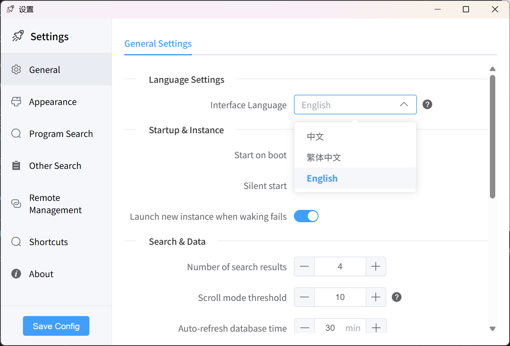

<div align="center">


[](https://www.gnu.org/licenses/gpl-3.0)
[](https://deepwiki.com/ghost-him/ZeroLaunch-rs)
[](https://github.com/ghost-him/ZeroLaunch-rs/releases)
[](https://github.com/ghost-him/ZeroLaunch-rs/graphs/commit-activity)
[](https://github.com/ghost-him/ZeroLaunch-rs/actions/workflows/ci.yml)

</div>

<div align="center">

[](https://gitee.com/ghost-him/ZeroLaunch-rs/stargazers)
[](https://gitee.com/ghost-him/ZeroLaunch-rs/members)
[](https://github.com/ghost-him/ZeroLaunch-rs/stargazers)
[](https://github.com/ghost-him/ZeroLaunch-rs/network/members)
[](https://gitcode.com/ghost-him/ZeroLaunch-rs/stargazers)

</div>

<div align="center">

[简体中文](README.md) | [繁體中文](readme-cn2.md) | [English](readme-en.md)

</div>


<div align="center">
    <a href="https://gitee.com/ghost-him/ZeroLaunch-rs" target="_blank">Gitee</a> •
    <a href="https://github.com/ghost-him/ZeroLaunch-rs" target="_blank">GitHub</a> •
    <a href="https://gitcode.com/ghost-him/ZeroLaunch-rs" target="_blank">GitCode</a> •
    <a href="https://zerolaunch.ghost-him.com" target="_blank">官網</a> •
    <a href="https://github.com/ghost-him/ZeroLaunch-rs/wiki" target="_blank">Wiki</a>
</div>

## 📕 一句話介紹

ZeroLaunch 是一款懂你輸入習慣的 Windows 智慧啟動器。它精通拼音與模糊搜尋，還能選配本地 AI 語意理解，讓錯字、搜詞都能秒速響應。純淨、離線，一切為高效而生。

> 市面上現有的啟動器總有點不合我心意，索性自己造了一個。現在它已是我每天工作的得力助手，所以請放心，我不會跑路的～（最多是更新慢點 (～￣▽￣)～）

## 🖥️ 軟體介面

[](asset/picture.md)

*點擊圖片查看完整功能截圖集*

**背景圖片可自定義**


## ✨ 特色亮點

### 🔒 隱私至上，完全離線
所有搜尋與配對均在本地完成，無需網路連接，堅持零資料採集。你的資料，永遠只留在你的裝置裡。

### ⚡ 智慧搜尋，毫秒響應
- **可選 AI 語意搜尋**：整合 EmbeddingGemma-300m 本地模型，支援自然語言、多語言意圖檢索，理解更智慧。
- **強大傳統演算法**：基於自研匹配演算法，支援全稱、拼音、首字母三重匹配與拼寫糾錯，高效且容錯性高。
- **極致效能最佳化**：透過資料結構最佳化、分層快取、按需載入與並發處理，確保即使在中低階配備上也能獲得毫秒級響應體驗。

> 💡 **想要深入了解搜尋演算法的實作原理？** 請參考 GitHub Wiki：[搜尋介紹](https://github.com/ghost-him/ZeroLaunch-rs/wiki/%E6%90%9C%E7%B4%A2%E4%BB%8B%E7%BB%8D)

### 🌐 輕巧純粹，開箱即用
專注於「快速、準確地啟動」這一核心需求。預設設定已覆蓋大多數使用場景，上手零成本；同時也為進階使用者提供了豐富的外觀、行為與索引策略自定義選項，不加任何冗餘功能。

## 🔧 核心功能一覽

### 🎯 核心搜尋與啟動
*   **AI 語意檢索（可選）**：基於輕量高效的 EmbeddingGemma-300m 本地模型，支援用自然語言（如「音樂軟體」）尋找應用程式，隱私安全。
*   **應用程式搜尋**：快速檢索並啟動傳統應用程式及 UWP 應用程式，支援備註與別名，識別本地化名稱。
*   **應用程式喚醒**：智慧將已執行程式的視窗置前，快速切換任務。
*   **開啟檔案所在目錄**：透過右鍵選單快速定位檔案位置。

### 🎨 個性化與互動
*   **高度自定義外觀**：支援自定義背景、顏色、字體、毛玻璃效果、圓角、視窗尺寸等，並提供便捷的調節按鈕。
*   **多語言介面**：支援簡體中文、繁體中文與英文，自動匹配系統語言。
*   **自定義快速鍵**：所有核心操作快速鍵均可按習慣重新映射。
*   **呼叫位置跟隨滑鼠**：搜尋欄會智慧地在滑鼠所在的顯示器上彈出。

### ⚙️ 進階與效率工具
*   **自定義索引項**：支援透過萬用字元或正規表示式（Regex）添加程式、檔案、網頁與指令（如關機、開啟特定設定頁）。
*   **搜尋演算法微調**：可調整匹配演算法參數，滿足個性化需求。
*   **智慧圖示載入**：盡最大努力載入正確圖示，完美支援 Steam 遊戲。
*   **設定檔多端同步**：支援本地儲存或透過 WebDAV 進行網路同步。
*   **開機自啟與靜默啟動**：一鍵設定，啟動即用。
*   **遊戲模式**：可手動禁用快速鍵，避免遊戲時誤觸。
*   **最近啟動程式**：按住 `Alt` 鍵可查看並快速開啟最近使用的程式。
*   **結果顯示最佳化**：可設定數量閾值，超出後自動切換為捲動顯示。
*   **Everything 模式**：按 `Ctrl + e` 切換到更廣泛的檔案系統路徑搜尋模式，快速定位任意檔案。（註：Everything 模式目前僅支援 x86_64 架構，不支援 arm64。）


## 🚀 快速入門

### 快速鍵速查

| 功能                             | 快速鍵                    |
| :------------------------------- | :------------------------ |
| 呼叫/隱藏搜尋欄                  | `Alt + Space`             |
| 上下選擇項目                     | `↑`/`↓` 或 `Ctrl + k`/`j` |
| 啟動選中程式                     | `Enter`                   |
| 以管理員權限啟動（普通應用程式） | `Ctrl + Enter`            |
| 清空搜尋框                       | `Esc`                     |
| 隱藏搜尋介面                     | 點擊搜尋框外部區域        |
| 切換到已開啟的視窗               | `Shift + Enter`           |
| 按最近啟動時間排序               | 按住 `Alt` 鍵             |
| 進入/退出 Everything 模式        | `Ctrl + e`                |

### 常見功能的實現

程式添加，檔案添加，指令添加，搜尋演算法微調等功能的實現以及**常見的問題**的解決辦法詳見以下文件：[wiki](https://github.com/ghost-him/ZeroLaunch-rs/wiki)

文件寫起來好麻煩，有時描述也不夠直觀 (っ °Д °;)っ。你也可以去 [DeepWiki](https://deepwiki.com/ghost-him/ZeroLaunch-rs) 看看，那裡的講解也許更清楚。

## 🚩 程式下載

### 使用 Winget 安裝（推薦）
在終端機中執行以下任一指令即可：
```bash
winget install zerolaunch
# 或
winget install ZeroLaunch-rs
# 或
winget install ghost-him.ZeroLaunch-rs
```

### 手動下載安裝包
本專案採用 CI/CD 自動構建。新版本發布時，會自動構建 AI 版與 Lite 版（x64/arm64），並同步至以下鏡像，請選擇訪問最快的來源下載：

*   **GitHub Releases** (全球使用者推薦): [https://github.com/ghost-him/ZeroLaunch-rs/releases](https://github.com/ghost-him/ZeroLaunch-rs/releases)
*   **Gitee Releases** (中國大陸使用者推薦): [https://gitee.com/ghost-him/ZeroLaunch-rs/releases](https://gitee.com/ghost-him/ZeroLaunch-rs/releases)
*   **GitCode Releases** (中國大陸使用者推薦): [https://gitcode.com/ghost-him/ZeroLaunch-rs/releases](https://gitcode.com/ghost-him/ZeroLaunch-rs/releases)

### 🧩 版本說明：AI 版 vs Lite 版
| 特性            | **含 AI 版 (預設/推薦)**                                         | **Lite 版 (輕量)**                                                    |
| :-------------- | :--------------------------------------------------------------- | :-------------------------------------------------------------------- |
| **AI 語意搜尋** | ✅ 支援 (需額外下載模型)                                          | ❌ 不支援                                                              |
| **記憶體佔用**  | 啟用 AI 時 ~500-550 MB<br>僅傳統搜尋時同 Lite 版                 | ~60-70 MB                                                             |
| **安裝包標識**  | 檔名**不含** `lite`，如：<br>`zerolaunch-rs_0.x.x_x64-setup.exe` | 檔名**包含** `lite`，如：<br>`zerolaunch-rs_lite_0.x.x_x64-setup.exe` |

**開發者提示**：構建 AI 版需啟用 `ai` 特性；構建 Lite 版則移除該特性。使用 `xtask` 時，預設構建 AI 版，構建 Lite 版請添加 `--ai disabled` 參數。

## 🛠️ 開發者指南

詳細的開發指南、環境配置、構建步驟以及貢獻指南，請參考 [CONTRIBUTING.md](CONTRIBUTING.md)。

## 📦 資料目錄結構

程式提供**安裝版**與**可攜版**（Portable）兩種形式，資料儲存位置不同：
- **安裝版**：資料儲存在 `C:\Users\[使用者名稱]\AppData\Roaming\ZeroLaunch-rs\`
- **可攜版**：資料儲存在軟體同層目錄下

### 本地資料目錄結構

本地資料目錄中存放以下檔案：

```
本地資料目錄/                           # 安裝包版本：C:\Users\[使用者名稱]\AppData\Roaming\ZeroLaunch-rs\
                                        # 可攜版：軟體所在目錄
├── logs/                               # 執行日誌
├── icons/                              # 程式圖示快取
└── ZeroLaunch_local_config.json        # 本地設定檔，儲存相關資料以及遠端目錄路徑
```

### 遠端目錄結構

遠端目錄用於存放程式的詳細執行配置，預設為當前的本地資料目錄。透過遠端儲存可以實現兩台機器間的資料同步。

```
遠端目錄/                               # 預設與本地資料目錄相同
├── background.png                      # 自定義背景圖片
└── ZeroLaunch_remote_config.json       # 遠端設定檔，儲存程式執行配置
```

## ⚠️ 已知限制

*   **短詞搜尋**：當輸入字元數少於 3 個時，搜尋結果可能不夠精確。

## 🌍 語言支援

當前支援：簡體中文 (zh-Hans)、繁體中文 (zh-Hant)、English (en)。

### 切換語言

1.  開啟 ZeroLaunch 設定。
2.  進入「General」 -> 「Language Settings」。
3.  在「Interface language」下拉式選單中選擇所需語言。
4.  點擊「Save Config」保存。



> ZeroLaunch-rs 在初次啟動時會自動檢測當前系統使用的語言並選擇合適的語言

### 貢獻翻譯

我們非常歡迎社群幫助翻譯更多語言！翻譯檔案位於 `src-ui/i18n/locales/` 目錄。若要添加新語言，請：
1.  複製一份現有翻譯檔案（如 `en.json`）。
2.  重新命名為目標語言代碼（如 `fr.json`）。
3.  翻譯所有文字內容。
4.  提交 Pull Request。

感謝你幫助 ZeroLaunch 走向世界！🙏

## 📄 第三方條款 — EmbeddingGemma

*   本專案可選整合 Google 的 EmbeddingGemma 模型，僅用於離線語意檢索。
*   使用與再分發須遵守 [Gemma 使用條款](https://ai.google.dev/gemma/terms) 及 [禁止用途政策](https://ai.google.dev/gemma/prohibited_use_policy)。
*   如再分發該模型或其衍生物，需：
    1.  在您的協議中傳遞上述限制；
    2.  向接收方提供 Gemma 條款副本；
    3.  標註被修改的檔案；
    4.  隨附名為 `NOTICE` 的文字檔案，內容為：`"Gemma is provided under and subject to the Gemma Terms of Use found at ai.google.dev/gemma/terms"`。

## ✍️ 程式碼簽章

程式碼簽章由 SignPath 提供，詳情請見 [程式碼簽章](CODE_SIGNING.md)

### 隱私聲明
除非使用者明確要求，否則本程式不會向任何外部系統傳輸資訊。詳情請見 [隱私政策](PRIVACY.md)。

## 🤝 開源致謝

本專案基於以下優秀開源專案構建：

* [chinese-xinhua](https://github.com/pwxcoo/chinese-xinhua) - 中文轉拼音核心詞典
* [LaunchyQt](https://github.com/samsonwang/LaunchyQt) - UWP 應用程式索引方案
* [bootstrap](https://icons.bootcss.com/) - 提供了部分的程式圖示
* [icon-icons](https://icon-icons.com/zh/) - 提供了部分的程式圖示
* [Follower-v2.0](https://github.com/MrBeanCpp/Follower-v2.0) - 提供了全螢幕檢測的方案

## 💝 贊助商

感謝以下贊助商對 ZeroLaunch-rs 的大力支持，讓專案變得更好 (´▽´ʃ♡ƪ)

<table>
  <tr>
    <td width="60" align="center" valign="middle">
      <a href="https://signpath.io" target="_blank" rel="noopener noreferrer">
        
      </a>
    </td>
    <td align="left" valign="middle">
      Windows 平台的免費程式碼簽章由 <a href="https://signpath.io" target="_blank" rel="noopener noreferrer"><b>SignPath.io</b></a> 提供，憑證由 <a href="https://signpath.org" target="_blank" rel="noopener noreferrer"><b>SignPath Foundation</b></a> 提供。
    </td>
  </tr>
</table>

## ❤️ 支持作者

如果你喜歡 ZeroLaunch-rs，可以透過以下方式支持我們：

1. 點一個免費的小星星⭐
2. 把這個專案分享給其他感興趣的朋友
3. 提出更多改進的建議（ZeroLaunch-rs 的定位就是純粹的程式啟動器，所以只會專注於啟動器的功能，不會添加太多無關的功能哦，請諒解🥺🙏）

> 本專案目前**僅主動優化核心搜尋啟動功能**，其他功能不在優先級之內。如果你有功能需求或發現 Bug，歡迎提交 Issue。我會定期查看反饋，並根據實際情況進行優化和修復。感謝你的理解與支持！

[](https://www.star-history.com/#ghost-him/zerolaunch-rs&Date)