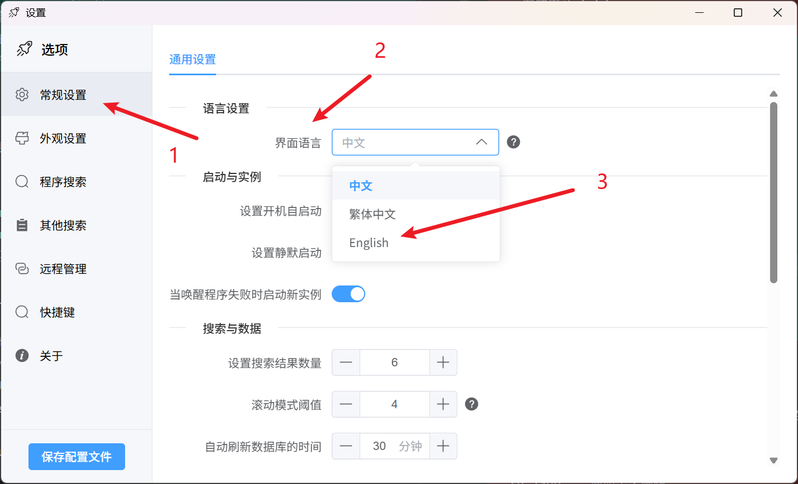

<div align="center">


[](https://www.gnu.org/licenses/gpl-3.0)
[](https://deepwiki.com/ghost-him/ZeroLaunch-rs)
[](https://github.com/ghost-him/ZeroLaunch-rs/releases)
[](https://github.com/ghost-him/ZeroLaunch-rs/graphs/commit-activity)
[](https://github.com/ghost-him/ZeroLaunch-rs/actions/workflows/ci.yml)

</div>

<div align="center">

[](https://gitee.com/ghost-him/ZeroLaunch-rs/stargazers)
[](https://gitee.com/ghost-him/ZeroLaunch-rs/members)
[](https://github.com/ghost-him/ZeroLaunch-rs/stargazers)
[](https://github.com/ghost-him/ZeroLaunch-rs/network/members)
[](https://codeberg.org/ghost-him/ZeroLaunch-rs)
[](https://gitcode.com/ghost-him/ZeroLaunch-rs/stargazers)
[](https://gitcode.com/ghost-him/ZeroLaunch-rs)

</div>

<div align="center">

[简体中文](README.md) | [繁體中文](readme-cn2.md) | [English](readme-en.md)

</div>


<div align="center">
    <a href="https://gitee.com/ghost-him/ZeroLaunch-rs" target="_blank">Gitee</a> •
    <a href="https://github.com/ghost-him/ZeroLaunch-rs" target="_blank">GitHub</a> •
    <a href="https://codeberg.org/ghost-him/ZeroLaunch-rs" target="_blank">Codeberg</a> •
    <a href="https://gitcode.com/ghost-him/ZeroLaunch-rs" target="_blank">GitCode</a> •
    <a href="https://zerolaunch.ghost-him.com" target="_blank">Official Website</a> •
    <a href="https://github.com/ghost-him/ZeroLaunch-rs/wiki" target="_blank">Wiki</a>
</div>

## 📕 Introduction

ZeroLaunch is a smart Windows launcher that understands your typing habits. It masters Pinyin and fuzzy search, and supports optional local AI semantic understanding, allowing for instant responses even with typos or vague search terms. Pure, offline, and born for efficiency.

> Existing launchers on the market didn't quite fit my needs, so I built one myself. It has become my capable assistant for daily work, so rest assured, I won't abandon this project~ (Updates might just be a bit slow sometimes (～￣▽￣)～).

## 🖥️ Software Interface

[](asset/picture.md)

*Click the image to view the full collection of feature screenshots*

**Background image is customizable**

## ✨ Highlights

### 🔒 Privacy First, Completely Offline
All searching and matching are done locally without any network connection. We adhere to zero data collection. Your data stays on your device forever.

### ⚡ Smart Search, Millisecond Response
- **Optional AI Semantic Search**: Integrated with the EmbeddingGemma-300m local model, supporting natural language and multi-language intent retrieval for smarter understanding.
- **Powerful Traditional Algorithms**: Based on self-developed matching algorithms, supporting full name, Pinyin, initial letter matching, and typo correction. Highly efficient with high fault tolerance.
- **Extreme Performance Optimization**: Through data structure optimization, layered caching, on-demand loading, and concurrent processing, it ensures a millisecond-level response experience even on low-to-mid-range devices.

> 💡 **Want to dive deeper into the search algorithm principles?** Check out the GitHub Wiki: [Search Introduction](https://github.com/ghost-him/ZeroLaunch-rs/wiki/%E6%90%9C%E7%B4%A2%E4%BB%8B%E7%BB%8D)

### 🌐 Lightweight & Pure, Out-of-the-Box
Focused on the core need of "launching quickly and accurately." Default settings cover most usage scenarios with zero learning cost; meanwhile, it provides rich customization options for appearance, behavior, and indexing strategies for advanced users, without adding any bloated features.

## 🔧 Core Features Overview

### 🎯 Core Search & Launch
*   **AI Semantic Retrieval (Optional)**: Based on the lightweight and efficient EmbeddingGemma-300m local model, supports finding apps using natural language (e.g., "music software") while keeping privacy secure.
*   **Application Search**: Quickly retrieve and launch traditional apps and UWP apps, supporting remarks, aliases, and localized name recognition.
*   **Application Awake**: Smartly brings the windows of running programs to the front for quick task switching.
*   **Open File Location**: Quickly locate files via the right-click menu.

### 🎨 Personalization & Interaction
*   **Highly Customizable Appearance**: Supports customization of background, colors, fonts, blur effects, corner radius, window size, etc., with convenient adjustment buttons.
*   **Multi-language Interface**: Supports Simplified Chinese, Traditional Chinese, and English, automatically matching the system language.
*   **Custom Hotkeys**: All core operation hotkeys can be remapped according to your habits.
*   **Mouse Following**: The search bar intelligently pops up on the monitor where the mouse is located.

### ⚙️ Advanced & Efficiency Tools
*   **Custom Indexing**: Supports adding programs, files, websites, and commands (e.g., shutdown, open specific settings pages) via wildcards or regular expressions.
*   **Search Algorithm Fine-tuning**: Adjustable matching algorithm parameters to meet personalized needs.
*   **Smart Icon Loading**: Strives to load the correct icons, with perfect support for Steam games.
*   **Config Sync**: Supports local storage or network synchronization via WebDAV.
*   **Auto-start & Silent Start**: One-click setup, ready to use upon boot.
*   **Game Mode**: Manually disable hotkeys to avoid accidental triggers during gaming.
*   **Recent Apps**: Hold the `Alt` key to view and quickly open recently used programs.
*   **Result Display Optimization**: Set a quantity threshold, automatically switching to scrolling display when exceeded.
*   **Everything Mode**: Press `Ctrl + e` to switch to a broader file system path search mode to quickly locate any file. (Note: Everything Mode currently only supports x86_64 architecture; arm64 is not supported.)

## 🚀 Quick Start

### Hotkey Cheat Sheet

| Function                             | Hotkey                       |
| :----------------------------------- | :--------------------------- |
| Show/Hide Search Bar                 | `Alt + Space`                |
| Select Item Up/Down                  | `↑`/`↓` or `Ctrl + k`/`j`    |
| Launch Selected Program              | `Enter`                      |
| Run as Administrator (Standard Apps) | `Ctrl + Enter`               |
| Clear Search Box                     | `Esc`                        |
| Hide Interface                       | Click outside the search box |
| Switch to Open Window                | `Shift + Enter`              |
| Sort by Recent Launch Time           | Hold `Alt`                   |
| Enter/Quit Everything Mode           | `Ctrl + e`                   |

### Implementation of Common Features

For details on adding programs, files, commands, fine-tuning search algorithms, and solutions to **common issues**, please refer to the following documentation: [wiki](https://github.com/ghost-him/ZeroLaunch-rs/wiki)

Writing documentation is troublesome, and sometimes descriptions aren't intuitive enough (っ °Д °;)っ. You can also check [DeepWiki](https://deepwiki.com/ghost-him/ZeroLaunch-rs), where the explanations might be clearer.

## 🚩 Download

### Install via Winget (Recommended)
Run any of the following commands in your terminal:
```bash
winget install zerolaunch
# or
winget install ZeroLaunch-rs
# or
winget install ghost-him.ZeroLaunch-rs
```

### Manual Download
This project uses CI/CD for automatic builds. When a new version is released, AI and Lite versions (x64/arm64) are automatically built and synced to the following mirrors. Please choose the fastest source for you:

*   **GitHub Releases** (Global): [https://github.com/ghost-him/ZeroLaunch-rs/releases](https://github.com/ghost-him/ZeroLaunch-rs/releases)
*   **Codeberg Releases** (Recommended): [https://codeberg.org/ghost-him/ZeroLaunch-rs/releases](https://codeberg.org/ghost-him/ZeroLaunch-rs/releases)
*   **Gitee Releases** (Mainland China): [https://gitee.com/ghost-him/ZeroLaunch-rs/releases](https://gitee.com/ghost-him/ZeroLaunch-rs/releases)
*   **GitCode Releases** (Mainland China): [https://gitcode.com/ghost-him/ZeroLaunch-rs/releases](https://gitcode.com/ghost-him/ZeroLaunch-rs/releases)

### 🧩 Version Explanation: AI Version vs Lite Version
| Feature                | **AI Version (Default/Recommended)**                                               | **Lite Version**                                                                |
| :--------------------- | :--------------------------------------------------------------------------------- | :------------------------------------------------------------------------------ |
| **AI Semantic Search** | ✅ Supported (requires extra model download)                                        | ❌ Not Supported                                                                 |
| **RAM Usage**          | ~500-550 MB when AI is enabled<br>Same as Lite when using only traditional search  | ~60-70 MB                                                                       |
| **Installer ID**       | Filename **does not** contain `lite`, e.g.:<br>`zerolaunch-rs_0.x.x_x64-setup.exe` | Filename **contains** `lite`, e.g.:<br>`zerolaunch-rs_lite_0.x.x_x64-setup.exe` |

**Developer Note**: Building the AI version requires enabling the `ai` feature; building the Lite version removes this feature. When using `xtask`, it defaults to building the AI version. To build the Lite version, add the `--ai disabled` argument.

## 🛠️ Developer Guide

For detailed development guides, environment configuration, build steps, and contribution guidelines, please refer to [CONTRIBUTING.md](CONTRIBUTING.md).

## 📦 Data Directory Structure

The program is available in **Installer** and **Portable** versions, with different data storage locations:
- **Installer Version**: Data is stored in `C:\Users\[Username]\AppData\Roaming\ZeroLaunch-rs\`
- **Portable Version**: Data is stored in the same directory as the software.

### Local Data Directory Structure

The local data directory contains the following files:

```
Local Data Directory/                   # Installer: C:\Users\[Username]\AppData\Roaming\ZeroLaunch-rs\
                                        # Portable: Software directory
├── logs/                               # Runtime logs
├── icons/                              # Program icon cache
└── ZeroLaunch_local_config.json        # Local config file, stores related data and remote directory path
```

### Remote Directory Structure

The remote directory is used to store detailed runtime configurations of the program, defaulting to the current local data directory. Remote storage allows for data synchronization between two machines.

```
Remote Directory/                       # Defaults to the same as Local Data Directory
├── background.png                      # Custom background image
└── ZeroLaunch_remote_config.json       # Remote config file, stores program runtime settings
```

## ⚠️ Known Limitations

*   **Short Word Search**: When the input character count is less than 3, search results may not be precise enough.

## 🌍 Language Support

Currently supported: Simplified Chinese (zh-Hans), Traditional Chinese (zh-Hant), English (en).

### Changing Language

1.  Open ZeroLaunch Settings.
2.  Go to "General" -> "Language Settings".
3.  Select the desired language from the "Interface language" dropdown menu.
4.  Click "Save Config" to save.



> ZeroLaunch-rs will automatically detect the current system language and select the appropriate language upon first launch.

### Contribute Translations

We welcome the community to help translate more languages! Translation files are located in the `src-ui/i18n/locales/` directory. To add a new language, please:
1.  Copy an existing translation file (e.g., `en.json`).
2.  Rename it to the target language code (e.g., `fr.json`).
3.  Translate all text content.
4.  Submit a Pull Request.

Thank you for helping ZeroLaunch go global! 🙏

## 📄 Third-Party Terms — EmbeddingGemma

*   This project optionally integrates Google's EmbeddingGemma model, solely for offline semantic retrieval.
*   Use and redistribution must comply with the [Gemma Terms of Use](https://ai.google.dev/gemma/terms) and [Prohibited Use Policy](https://ai.google.dev/gemma/prohibited_use_policy).
*   If you redistribute this model or its derivatives, you must:
    1.  Pass on the above restrictions in your agreement;
    2.  Provide the recipient with a copy of the Gemma Terms;
    3.  Mark modified files;
    4.  Include a text file named `NOTICE` containing: `"Gemma is provided under and subject to the Gemma Terms of Use found at ai.google.dev/gemma/terms"`.

## ✍️ Code Signing

Code signing is provided by SignPath. For details, please see [Code Signing](CODE_SIGNING.md).

### Privacy Policy
Unless explicitly requested by the user, this program will not transmit information to any external system. For details, please see the [Privacy Policy](PRIVACY.md).

## 🤝 Open Source Credits

This project is built upon the following excellent open-source projects:

* [chinese-xinhua](https://github.com/pwxcoo/chinese-xinhua) - Core dictionary for Chinese-to-Pinyin conversion
* [LaunchyQt](https://github.com/samsonwang/LaunchyQt) - UWP application indexing solution
* [bootstrap](https://icons.bootcss.com/) - Provided some program icons
* [icon-icons](https://icon-icons.com/zh/) - Provided some program icons
* [Follower-v2.0](https://github.com/MrBeanCpp/Follower-v2.0) - Provided the full-screen detection solution

## 💝 Sponsors

Thanks to the following sponsors for their strong support of ZeroLaunch-rs, making the project better (´▽´ʃ♡ƪ)

<table>
  <tr>
    <td width="60" align="center" valign="middle">
      <a href="https://signpath.io" target="_blank" rel="noopener noreferrer">
        
      </a>
    </td>
    <td align="left" valign="middle">
      Free code signing on Windows provided by <a href="https://signpath.io" target="_blank" rel="noopener noreferrer"><b>SignPath.io</b></a>, certificate by <a href="https://signpath.org" target="_blank" rel="noopener noreferrer"><b>SignPath Foundation</b></a>.
    </td>
  </tr>
</table>

## ❤️ Support the Author

If you like ZeroLaunch-rs, you can support us in the following ways:

1. Give a free star ⭐
2. Share this project with other interested friends
3. Offer suggestions for improvement (ZeroLaunch-rs is positioned as a pure application launcher, so we will focus on launcher functions and won't add too many unrelated features, please understand 🥺🙏)

> This project currently **focuses on optimizing core search and launch features only**. Other features are not prioritized at this stage. If you have feature requests or discover bugs, please feel free to submit an Issue. I'll review feedback regularly and optimize or fix issues accordingly. Thank you for your understanding and support!

[](https://www.star-history.com/#ghost-him/zerolaunch-rs&Date)